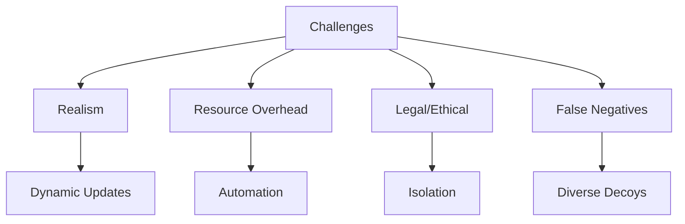

# Challenges and Mitigation Strategies

## Challenges
- **Realism**: Decoys must blend in to fool attackers.
- **Resource Overhead**: High-interaction setups are demanding.
- **Legal/Ethical**: Privacy and entrapment risks.
- **False Negatives**: Attackers may evade detection.

## Mitigation Strategies
- **Dynamic Realism**: Regularly update decoys.
- **Automation**: Simplify management and scaling.
- **Isolation**: Protect production systems.
- **Diversity**: Use varied decoy types.
- **SIEM Integration**: Streamline alert handling.

