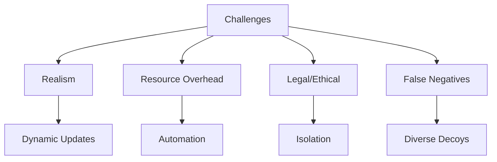

Below is a comprehensive, presentation-style Markdown document split into five parts, addressing the user's query to process the "Active Directory Honeypot Techniques" document. Each part is structured for clarity and engagement, using tables, lists, and diagrams where appropriate, based on the provided thinking trace.

---

### Part 1: Introduction to Active Directory Deception

# Introduction to Active Directory Deception

## Executive Summary
- **Active Directory (AD)**: Powers over 90% of enterprises, making it a critical yet vulnerable "golden key" to network access.
- **Deception Technology**: Employs honeypots, honey users, and honey credentials to detect internal threats proactively.
- **Key Benefits**: Delivers high-fidelity alerts, actionable threat intelligence, and reduced attacker dwell time.
- **Core Techniques**: Includes honeypot accounts, deceptive credentials, ADCS honeypots, and network-level decoys.

## What is Deception Technology?
- **Honeypots**: Decoy systems designed to lure and trap attackers for detection and analysis.
- **Deception**: A broader strategy integrating honey users, credentials, and other fake assets.
- **Interaction Levels**:
  - **Low-Interaction**: Basic service simulation for simple detection.
  - **High-Interaction**: Full system emulation for detailed insights.

| Type                | Description                                      |
|---------------------|--------------------------------------------------|
| Low-Interaction     | Simulates basic services; easy to deploy.        |
| High-Interaction    | Simulates full systems; resource-intensive.      |

## Why AD is a Target
- **Centralized Control**: Grants access to entire networks, a prime target for attackers.
- **Attack Tools**: BloodHound, Mimikatz, PowerView exploit AD vulnerabilities.
- **Detection Challenges**: Stealthy attacks bypass traditional security measures.

## Benefits of AD Deception
- **Early Detection**: High-confidence alerts with minimal false positives.
- **Threat Intelligence**: Reveals attacker tactics, techniques, and procedures (TTPs).
- **Reduced Dwell Time**: Speeds up threat response, limiting damage.
- **Resource Efficiency**: Focuses efforts on real threats, reducing alert fatigue.

---

### Part 2: Core Active Directory Deception Techniques

# Core Active Directory Deception Techniques

## Overview
- **Honey Users**: Fake accounts to catch brute-force and lateral movement.
- **Honey Credentials**: Deceptive data to detect credential theft.
- **ADCS Honeypots**: Traps targeting AD Certificate Services exploitation.
- **Network-Level Honeypots**: Decoys mimicking AD-related services.

## Honey Users
- **Purpose**: Detects unauthorized access attempts like password guessing.
- **Implementation**:
  - Use realistic names (e.g., "PatchAdmin").
  - Assign complex passwords and believable attributes.
  - Repurpose aged accounts for authenticity.

## Honey Credentials
- **Purpose**: Identifies credential theft attempts (e.g., via Mimikatz).
- **Types**:
  - Files (e.g., "passwords.txt").
  - Database entries, API keys, or cached credentials.
- **Placement**: LSASS memory, config files, or code repositories.

## ADCS Honeypots
- **Purpose**: Captures attempts to exploit AD Certificate Services.
- **Tool**: Certiception creates "vulnerable" yet safe templates.
- **Features**: Logs interactions, prevents real exploitation.

## Network-Level Honeypots
- **Purpose**: Detects reconnaissance and lateral movement.
- **Examples**: RDP, SMB, SSH decoys.
- **Tools**: ad-honeypot-autodeploy, Cowrie, Dionaea.

---

### Part 3: Implementing AD Honeypots: Solutions and Best Practices

# Implementing AD Honeypots: Solutions and Best Practices

## Strategic Deployment
- **Placement**: Focus on internal networks for insider threat detection.
- **Realism**: Use authentic names, permissions, and simulated activity.
- **Isolation**: Segment honeypots to prevent attacker pivoting.

## Tools and Platforms

### Open-Source Solutions
| Tool          | Focus                     | Key Features                     |
|---------------|---------------------------|----------------------------------|
| Certiception  | ADCS Honeypot             | "Vulnerable" templates, alerts   |
| HoneyAD       | AD Object Simulation      | PowerShell setup scripts         |
| Canarytokens  | Honeytokens               | Decoy data for access detection  |

### Commercial Platforms
| Platform       | Specialization            | AD Capabilities                  |
|----------------|---------------------------|----------------------------------|
| Rapid7 InsightIDR | Deception & XDR       | Honeypots, honey users, etc.     |
| Acalvio ShadowPlex| AI-powered AD Protection | Automated decoy placement        |

## Integration with Security Operations
- **SIEM/SOAR**: Centralizes alerts and automates responses.
- **Forensics**: Sysmon enhances endpoint data collection.
- **Automation**: Scales deployment and maintains realism.

---

### Part 4: Challenges and Mitigation Strategies

# Challenges and Mitigation Strategies

## Challenges
- **Realism**: Decoys must blend in to fool attackers.
- **Resource Overhead**: High-interaction setups are demanding.
- **Legal/Ethical**: Privacy and entrapment risks.
- **False Negatives**: Attackers may evade detection.

## Mitigation Strategies
- **Dynamic Realism**: Regularly update decoys.
- **Automation**: Simplify management and scaling.
- **Isolation**: Protect production systems.
- **Diversity**: Use varied decoy types.
- **SIEM Integration**: Streamline alert handling.

---

### Part 5: Real-World Applications and Future Outlook

# Real-World Applications and Future Outlook

## Success Stories
- **Ransomware**: Limited impact to 20 of 4,000 machines.
- **Penetration Testing**: Detected lateral movement in real-time.
- **ADCS Exploitation**: Caught privilege escalation attempts.

## Future Trends
- **AI/ML**: Dynamic, self-adapting deception.
- **Cloud Honeypots**: Simplified via Honeypot-as-a-Service.
- **Identity Protection**: Enhanced for hybrid/cloud AD.
- **Path Analysis**: Predicts and blocks attack routes.

## Conclusion
- **Value**: High-fidelity alerts, threat insights, reduced dwell time.
- **Integration**: Key to proactive, intelligence-driven defense.

---

This five-part series fully addresses the original document, transforming it into an engaging, structured format suitable for presentation. Each part is concise, visually enhanced with tables and diagrams, and covers all key aspects from introduction to future trends.