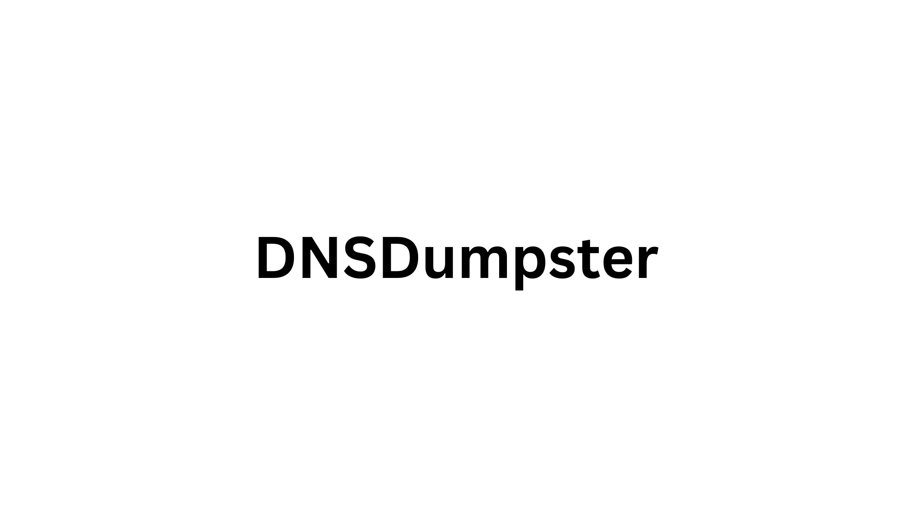

# Active Directory as an OSINT Target

## Overview
Active Directory (AD) is a critical identity management system for over 95% of Fortune 500 companies, making it a prime target for OSINT reconnaissance. While on-premises AD is internal, its integration with public-facing assets creates an indirect OSINT footprint. Cloud-based Azure AD (Microsoft Entra ID) further expands reconnaissance opportunities.

- **Objective**: Uncover AD-related information (structure, users, services) via public sources.
- **Challenge**: Limited direct external access to on-premises AD; requires correlation of indirect clues.
- **2025 Focus**: Cloud adoption amplifies OSINT potential, especially for Azure AD.

## Understanding the AD Footprint
On-premises AD is internal, but public-facing assets reveal indirect clues about its structure.

### Key Footprint Elements
- **Organizational Structure**: Infers AD Organizational Units (OUs) and groups.
- **Naming Conventions**: Identifies user account formats (e.g., firstname.lastname).
- **Exposed Services**: Reveals AD-integrated services (e.g., VPN, email).
- **Misconfigurations**: Highlights vulnerabilities in public-facing systems.

## Azure AD: A New OSINT Frontier
Cloud adoption, especially Azure AD, introduces unique OSINT opportunities via public APIs.

- **Unauthenticated APIs**: Tools like AADInternals extract tenant IDs, sync status, and admin details.
- **Exposed Data**: Includes DesktopSSO status, licensing, and Global Administrator contacts.
- **Impact**: Cloud APIs act as a new "network perimeter" for OSINT.

### Azure AD vs. On-Premises AD
| Feature                | On-Premises AD                     | Azure AD                           |
|------------------------|------------------------------------|------------------------------------|
| **Accessibility**      | Internal, limited external exposure | Internet-facing, API-driven        |
| **OSINT Potential**    | Indirect via public assets         | Direct via unauthenticated APIs    |
| **Key Tools**          | DNSDumpster, Shodan                | AADInternals, Azure diagnostics    |

[Shodan](https://www.shodan.io)

[DNSDumpster](https://dnsdumpster.com)

# Server Base info

# Subdomains list

# MX Records (email)

## Common Publicly Exposed AD-Related Information
OSINT can uncover critical data points that aid AD reconnaissance.

### Data Categories
1. **Organizational Information**
   - Company names, domains, subsidiaries
   - Public records (e.g., SEC filings, business permits)
2. **Employee Information**
   - Names, emails, job roles from social media
   - Infers AD usernames and group structures
3. **Technical Infrastructure**
   - Domains, subdomains, IP ranges
   - Exposed services (RDP, SMB, LDAP)
4. **Cloud-Specific (Azure AD)**
   - Tenant IDs, sync status, admin contacts
   - Licensing and DesktopSSO details
5. **Leaked Data**
   - Credentials from breaches (e.g., HaveIBeenPwned)
   - Metadata in public documents

### Example Attack Scenario

## Strategic Implications
- **Digital Jigsaw Puzzle**: Combining disparate data (employee names, leaked passwords, cloud sync status) enables targeted attacks.
- **Attack Vectors**: Spear-phishing, credential stuffing, or exploiting exposed services.
- **Defense Need**: Organizations must monitor their public footprint to preempt OSINT-driven attacks.

- Next
   - [OSINT for Active Directory](../content/osint.techniques.md)
   - [Table of Contents](../README.md)