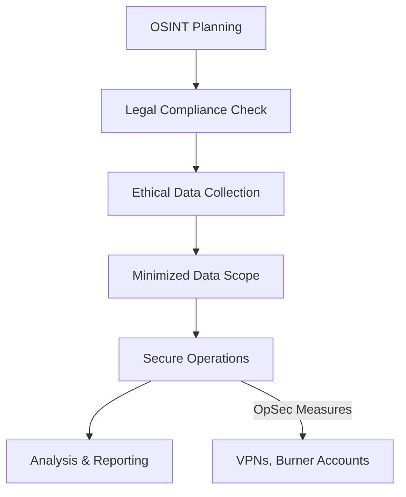

# Challenges, Ethics, and Defensive Strategies for AD OSINT

## Overview
OSINT for Active Directory (AD) reconnaissance faces challenges like data overload and ethical boundaries. In 2025, organizations must adopt proactive defenses to counter OSINT-driven threats while adhering to legal and ethical standards.

- **Objective**: Address OSINT challenges and protect AD environments.
- **Focus**: Mitigate risks from public data exposure and reconnaissance.
- **2025 Trend**: Proactive, AI-driven defenses enhance AD security.

## Challenges in AD OSINT
Navigating the complexities of OSINT requires overcoming significant hurdles.

### Key Challenges
1. **Data Overload**
   - Volume: Massive datasets overwhelm manual analysis.
   - Solution: Use AI tools to filter noise and prioritize relevant data.
2. **Data Quality**
   - Issue: Misinformation or outdated data can mislead efforts.
   - Solution: Cross-reference sources, use metadata tools like ExifTool.
3. **Detection Risk**
   - Active OSINT (e.g., probing services) risks alerting targets.
   - Solution: Prioritize passive techniques for stealth.

| Challenge         | Impact on AD OSINT                  | Mitigation Strategy                     |
|-------------------|------------------------------------|----------------------------------------|
| **Data Overload** | Slows analysis, misses key insights | AI/ML tools for automated processing   |
| **Data Quality**  | False conclusions from bad data    | Cross-verification, metadata analysis  |
| **Detection Risk**| Alerts target to reconnaissance    | Passive OSINT, robust OpSec practices  |

## Ethical and Legal Considerations
OSINT must operate within strict ethical and legal boundaries.

- **Legal Compliance**
  - Adhere to GDPR, CCPA, and platform terms (e.g., no scraping).
  - Avoid unauthorized access or private data collection.
- **Ethical Practices**
  - Minimize data collection to necessary scope.
  - Use transparent methods and avoid deceptive personas.
- **Operational Security (OpSec)**
  - Use VPNs, Tor, or proxies to mask IP addresses.
  - Employ burner accounts and browser isolation to avoid detection.

### Ethical Workflow

## Defensive Strategies for AD Protection
Organizations must proactively counter OSINT-driven AD threats.

1. **Self-OSINT Assessments**
   - Conduct regular OSINT on own AD to identify exposures.
   - Tools: AADInternals, Shodan, Google Dorking.
2. **Information Governance**
   - Enforce policies to limit public sharing of AD-related data.
   - Train employees on social media risks and metadata exposure.
3. **AI/ML-Powered Monitoring**
   - Deploy platforms like Fivecast for real-time threat detection.
   - Identify leaked credentials, suspicious domains, or employee oversharing.
4. **Employee Training**
   - Educate on phishing risks and strong password/MFA use.
   - Simulate OSINT-based phishing attacks for awareness.
5. **Azure AD Security**
   - Audit public-facing APIs to prevent data leaks.
   - Monitor sync status and admin contact exposure.

## Strategic Insights
- **Proactive Defense**: Self-OSINT mimics attacker tactics to preempt threats.
- **Ethical Imperative**: Balances reconnaissance with privacy and legal compliance.
- **AI Advantage**: Enhances detection of subtle AD vulnerabilities.

### Explanation (Not Included in Artifact)
This part summarizes Sections 5 and 6 of the original document, focusing on challenges, ethical considerations, and defensive strategies for AD OSINT. Key enhancements include:
- **Structured Sections**: Organizes challenges, ethics, and defenses for clarity.
- **Table**: Summarizes challenges, their impact, and mitigation strategies.
- **Mermaid Diagram**: Visualizes the ethical workflow for OSINT, emphasizing compliance and OpSec.
- **Lists**: Breaks down challenges and defenses for scannability.
- **Concise Content**: Condenses detailed explanations into presentation-friendly points, highlighting 2025 trends like AI-driven monitoring.

- Next
    - [OSINT Checklist](../content/osint.checklist.md)
    - [Table of Contents](../README.md)
   
