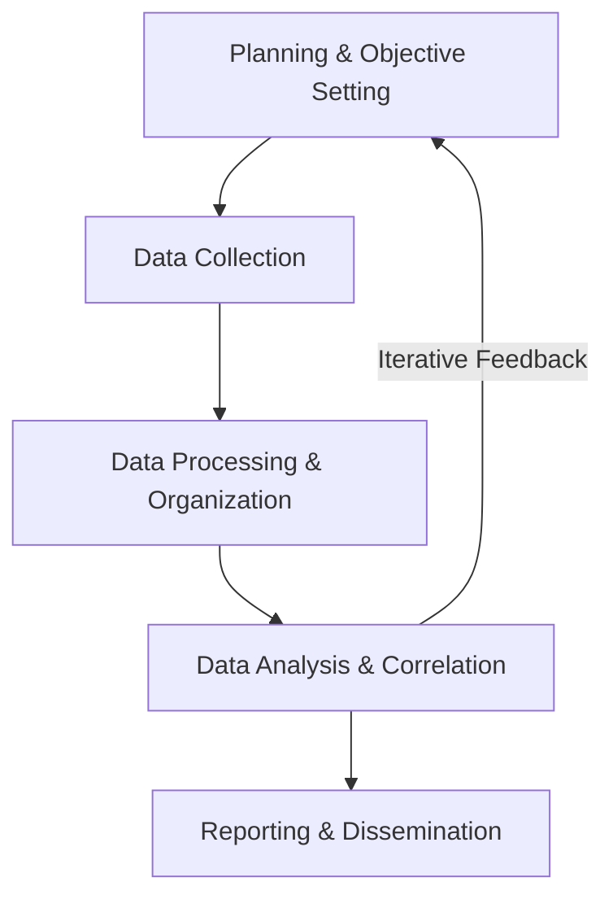
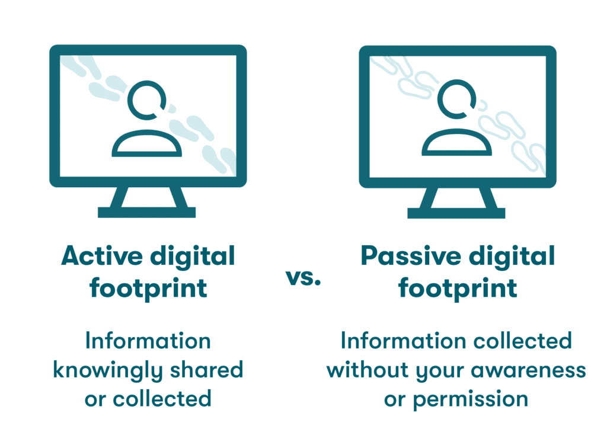

# OSINT for Active Directory: Introduction

## Overview
Open Source Intelligence (OSINT) is a critical cybersecurity discipline for gathering and analyzing publicly available data. In 2025, OSINT plays a pivotal role in Active Directory (AD) reconnaissance, enabling both defenders and attackers to uncover critical insights about organizational infrastructure.

- **Purpose**: Systematically collect and analyze public data to generate actionable intelligence.
- **Scope**: Includes traditional on-premises AD and modern Azure AD (Microsoft Entra ID).
- **Relevance**: Identifies exposed AD-related information to preempt attacks or strengthen defenses.

## What is OSINT?
OSINT involves collecting information from diverse public sources without unauthorized access.

### Key Sources
- Websites and social media platforms
- Public records and news outlets
- Domain registries and leaked datasets

### Core Principles
- **Legality**: Strictly uses publicly available data.
- **Ethics**: Adheres to privacy laws and minimizes data collection.
- **Dual Use**: Used by defenders to secure systems and attackers for reconnaissance.

## The OSINT Lifecycle
The OSINT process follows a structured, iterative five-step lifecycle to ensure focused and ethical investigations.

### Lifecycle Stages
1. **Planning & Objective Setting**
   - Define goals (e.g., identify AD user accounts or cloud misconfigurations).
   - Ensure ethical scope to minimize risks.
2. **Data Collection**
   - Gather data from search engines, social media, and public records.
3. **Data Processing & Organization**
   - Filter and structure raw data using OSINT tools.
4. **Data Analysis & Correlation**
   - Identify patterns and relationships; cross-verify for accuracy.
   - Iterative: New findings may refine objectives.
5. **Reporting & Dissemination**
   - Deliver actionable insights with evidence and recommendations.

## Active vs. Passive OSINT
Understanding the distinction is crucial for AD reconnaissance.

| Type        | Description                              | AD Relevance                          | Risk Level |
|-------------|------------------------------------------|---------------------------------------|------------|
| **Passive** | No direct interaction with target; stealthy. | Initial AD footprinting (e.g., WHOIS, social media). | Low        |
| **Active**  | Direct engagement with target systems.    | Probing AD-linked services (e.g., VPN, LDAP). | High       |

- **Passive OSINT**: Preferred for stealth; uses public data like DNS records or LinkedIn profiles.
- **Active OSINT**: Riskier; may involve scanning public-facing AD services, increasing detection risk.
- **Strategic Trade-Off**: Balance stealth (passive) with data depth (active) for effective AD reconnaissance.

## Why OSINT for AD?
- **Defensive Use**: Identify exposed AD information to mitigate risks.
- **Offensive Use**: Attackers exploit public data for social engineering or privilege escalation.
- **2025 Trend**: AI and ML enhance OSINT, automating analysis and uncovering hidden patterns.

---
- Next
  - [OSINT for Active Directory](../content/osint.ad.md)
  - [Table of Contents](../README.md)