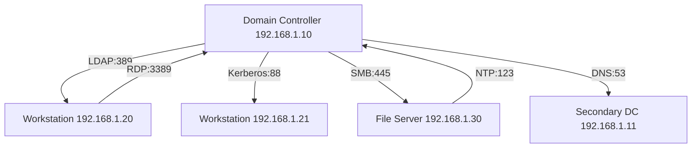

# Using Nmap for Penetration Testing in Active Directory Environments

Nmap (Network Mapper) is a powerful open-source tool for network discovery and security auditing. It is widely used by penetration testers to identify hosts, services, and vulnerabilities in target networks. This guide provides a detailed overview of using Nmap specifically for penetration testing in Active Directory (AD) environments. Below, you'll find 100 distinct Nmap commands and techniques, categorized by purpose, with explanations, tables, and diagrams to help you understand their application in AD pentesting.

---

## Table of Contents
- [Introduction to Nmap in AD Pentesting](#introduction-to-nmap-in-ad-pentesting)
- [Basic Nmap Commands for AD Discovery](#basic-nmap-commands-for-ad-discovery)
- [Advanced Scanning Techniques](#advanced-scanning-techniques)
- [Service Enumeration in AD](#service-enumeration-in-ad)
- [Vulnerability Scanning](#vulnerability-scanning)
- [Evasion and Stealth Techniques](#evasion-and-stealth-techniques)
- [Automation and Scripting](#automation-and-scripting)
- [Visualizing Results with Mermaid](#visualizing-results-with-mermaid)

---

## Introduction to Nmap in AD Pentesting

Active Directory environments are often the backbone of enterprise networks, managing authentication and authorization for users and systems. Penetration testers target AD to identify misconfigurations, weak credentials, and vulnerabilities that could lead to privilege escalation or lateral movement. Nmap plays a critical role in the reconnaissance and enumeration phases by mapping out the network and identifying AD-related services such as LDAP, Kerberos, SMB, and DNS.

**Key Objectives in AD Pentesting with Nmap:**
- Discover domain controllers and critical servers.
- Enumerate open ports and services related to AD (e.g., 445 for SMB, 389 for LDAP).
- Detect misconfigurations or outdated software.
- Identify potential attack vectors for lateral movement.

---

## Basic Nmap Commands for AD Discovery

Below are foundational Nmap commands tailored for discovering hosts and services in an AD environment. These commands focus on identifying domain controllers, workstations, and other critical assets.

| **Command**                              | **Purpose**                                      | **Explanation**                                                                 |
|------------------------------------------|-------------------------------------------------|---------------------------------------------------------------------------------|
| `nmap -sn 192.168.1.0/24`               | Ping scan for host discovery                   | Identifies live hosts in the target subnet without scanning ports.              |
| `nmap -p 445 192.168.1.0/24`            | Scan for SMB (port 445)                        | Targets port 445 to find hosts running SMB, often used in AD for file sharing.  |
| `nmap -p 389 192.168.1.0/24`            | Scan for LDAP (port 389)                       | Identifies LDAP servers, typically domain controllers in AD environments.       |
| `nmap -p 88 192.168.1.0/24`             | Scan for Kerberos (port 88)                    | Detects hosts running Kerberos, a key authentication protocol in AD.            |
| `nmap -p 53 192.168.1.0/24`             | Scan for DNS (port 53)                         | Finds DNS servers, often domain controllers, critical for AD name resolution.   |
| `nmap -A 192.168.1.10`                  | Aggressive scan with OS and service detection  | Provides detailed info on a specific host, including OS and service versions.   |
| `nmap --script smb-os-discovery 192.168.1.10` | SMB OS discovery script                   | Enumerates OS details via SMB, useful for identifying Windows versions in AD.   |
| `nmap -p 445 --script smb-vuln-ms17-010 192.168.1.0/24` | Check for EternalBlue vulnerability | Scans for MS17-010, a common exploit in AD environments (e.g., WannaCry).       |
| `nmap -sU -p 123 192.168.1.0/24`        | UDP scan for NTP (port 123)                    | Identifies NTP services, often used for time sync in AD environments.           |
| `nmap -p 3268 192.168.1.0/24`           | Scan for Global Catalog (port 3268)            | Finds domain controllers hosting the Global Catalog over LDAP.                  |

**Note:** Replace `192.168.1.0/24` with your target network range or specific IP addresses.

---

## Advanced Scanning Techniques

These commands focus on deeper enumeration and specific AD-related protocols. They are useful for identifying misconfigurations or extracting metadata.

| **Command**                                      | **Purpose**                              | **Explanation**                                                                 |
|--------------------------------------------------|------------------------------------------|---------------------------------------------------------------------------------|
| `nmap -p 445 --script smb-enum-shares 192.168.1.10` | Enumerate SMB shares                 | Lists accessible shares on a target, often revealing sensitive AD data.         |
| `nmap -p 445 --script smb-enum-users 192.168.1.10`  | Enumerate SMB users                  | Attempts to list user accounts via SMB, useful for AD credential harvesting.    |
| `nmap -p 389 --script ldap-rootdse 192.168.1.10`    | Enumerate LDAP RootDSE               | Extracts basic info about the LDAP server, such as domain and forest details.   |
| `nmap -p 88 --script krb5-enum-users --script-args krb5-enum-users.realm=domain.local 192.168.1.10` | Enumerate Kerberos users | Attempts to list valid usernames in the specified AD realm.                     |
| `nmap -sC -sV 192.168.1.10`                     | Default scripts and version detection | Runs default Nmap scripts and version detection for a comprehensive scan.       |
| `nmap -p 445 --script smb-protocols 192.168.1.10`   | Check SMB protocols                  | Identifies supported SMB versions, useful for finding outdated/insecure configs.|
| `nmap --script dns-srv-enum --script-args "dns-srv-enum.domain=domain.local"` | Enumerate DNS SRV records | Discovers AD services (e.g., Kerberos, LDAP) via DNS SRV records.               |
| `nmap -p 445 --script smb-security-mode 192.168.1.10` | Check SMB security mode            | Determines if SMB signing is enabled, a common misconfiguration in AD.          |
| `nmap -p 389 --script ldap-search --script-args "ldap.username=anonymous"` | Anonymous LDAP search         | Attempts to query LDAP anonymously, often revealing AD structure.               |
| `nmap --script smb-vuln-regsvc-dos 192.168.1.10`    | Check for SMB registry DoS vuln      | Scans for specific SMB vulnerabilities that could crash AD systems.             |

---

## Service Enumeration in AD

AD relies on several core services for functionality. These Nmap commands target specific ports and protocols to enumerate details about these services.

| **Service**       | **Port(s)**       | **Command**                              | **Explanation**                                                                 |
|--------------------|-------------------|------------------------------------------|---------------------------------------------------------------------------------|
| SMB               | 445, 139          | `nmap -p 445,139 --script smb-enum-domains 192.168.1.10` | Enumerates domain info via SMB.                             |
| LDAP/LDAPS        | 389, 636          | `nmap -p 389,636 --script ldap-novell-getpass 192.168.1.10` | Attempts to extract passwords if misconfigured.          |
| Kerberos          | 88                | `nmap -p 88 --script krb5-enum-users 192.168.1.10` | Enumerates users in the Kerberos realm.                         |
| DNS               | 53 (TCP/UDP)      | `nmap -p 53 --script dns-zone-transfer 192.168.1.10` | Attempts zone transfer to reveal AD DNS records.              |
| RDP               | 3389              | `nmap -p 3389 --script rdp-enum-encryption 192.168.1.10` | Checks RDP encryption levels on AD hosts.                 |
| WinRM             | 5985, 5986        | `nmap -p 5985,5986 --script http-winrm-auth 192.168.1.10` | Tests for WinRM authentication issues.                   |
| MSRPC             | 135               | `nmap -p 135 --script msrpc-enum 192.168.1.10` | Enumerates RPC services, often tied to AD functions.            |
| NetBIOS           | 137, 138 (UDP)    | `nmap -sU -p 137,138 --script nbstat 192.168.1.10` | Gathers NetBIOS info like computer name and domain.         |
| HTTP/HTTPS (ADFS) | 80, 443           | `nmap -p 80,443 --script http-title 192.168.1.10` | Identifies web services, potentially ADFS or other AD portals. |
| NTP               | 123 (UDP)         | `nmap -sU -p 123 --script ntp-info 192.168.1.10` | Retrieves NTP server details, critical for AD time sync.      |

explain RPC Services + examples

**RPC (Remote Procedure Call) Services:**
- **Overview**: RPC is a protocol that allows a program to request a service from a program located on another computer in a network without having to understand the network's details. In Active Directory environments, MSRPC (Microsoft RPC) is often used for various administrative functions, including managing services, file and printer sharing, and domain replication.
- **Usage in Hacking**: Attackers target RPC services to enumerate system information, execute remote code, or exploit vulnerabilities like MS08-067 (a well-known RPC vulnerability exploited by Conficker). RPC endpoints can reveal sensitive details about the system, making them a valuable target for reconnaissance.
- **Example**: Using the Nmap script `msrpc-enum` on port 135 can list available RPC services on a target machine, potentially exposing functions that can be abused for privilege escalation or lateral movement in an AD environment.

**NetBIOS (Network Basic Input/Output System) Information:**
- **Overview**: NetBIOS is a legacy protocol used for communication over local networks, primarily in Windows environments. It provides services for name resolution, session establishment, and data transfer, often running on ports 137 and 138 (UDP).
- **Usage in Hacking**: NetBIOS information can reveal hostnames, domain names, and network shares, which are critical for mapping an AD environment. Attackers use this data to identify targets for lateral movement or to attempt credential stuffing on exposed shares.
- **Example**: The Nmap script `nbstat` can retrieve NetBIOS names and MAC addresses from a target. This information can be used to spoof identities or build a network map for further attacks like SMB relay or brute-forcing domain accounts.

**ADFS (Active Directory Federation Services) Information:**
- **Overview**: ADFS is a Microsoft service that provides single sign-on (SSO) capabilities across trusted organizations or applications, often exposed on HTTP/HTTPS ports (80, 443). It facilitates federated identity and access management in AD environments.
- **Usage in Hacking**: ADFS portals are attractive targets because compromising them can grant access to multiple integrated applications or cloud services (e.g., Office 365). Attackers may look for misconfigured ADFS endpoints, weak authentication mechanisms, or vulnerabilities in web interfaces.
- **Example**: Using Nmap with the `http-title` script on ports 80 and 443 can help identify ADFS login pages or other web services tied to AD. Once identified, attackers might attempt phishing or exploit known ADFS vulnerabilities like CVE-2021-41379 to bypass authentication.

**NTP (Network Time Protocol) Server:**
- **Overview**: NTP is used to synchronize clocks across networked devices, critical in AD environments for ensuring Kerberos authentication works correctly (Kerberos is time-sensitive). It typically operates on port 123 (UDP).
- **Usage in Hacking**: Attackers may target NTP servers to disrupt time synchronization, potentially causing Kerberos ticket failures or logging discrepancies. Additionally, older NTP implementations have vulnerabilities (e.g., amplification attacks for DDoS) that can be exploited.
- **Example**: The Nmap script `ntp-info` can retrieve details about an NTP server, such as version and configuration. This information can be used to check for outdated versions vulnerable to exploits like CVE-2014-9295 (NTP amplification) or to manipulate time sync for Kerberos attacks like "Kerberoasting."

explain winRM info and usages for hacking

**WinRM (Windows Remote Management) Information:**
- **Overview**: WinRM is a Microsoft protocol for remote management of Windows systems, often used for PowerShell remoting and administrative tasks. It operates on ports 5985 (HTTP) and 5986 (HTTPS) in AD environments.
- **Usage in Hacking**: WinRM is a prime target for attackers because it allows remote code execution if credentials are compromised or if authentication is misconfigured (e.g., allowing basic auth over HTTP). It’s often used post-exploitation for lateral movement within an AD network.
- **Example**: The Nmap script `http-winrm-auth` can test for authentication issues on WinRM ports. If successful, attackers can use tools like Evil-WinRM to gain a shell on the target system, leveraging stolen credentials or misconfigurations for further AD compromise.

**RDP (Remote Desktop Protocol) Encryption Levels:**
- **Overview**: RDP is used for remote access to Windows systems, running on port 3389. It supports different encryption levels (Low, Client Compatible, High, and FIPS Compliant) to secure connections, which are critical in AD environments for protecting remote admin access.
- **Usage in Hacking**: Weak RDP encryption levels or misconfigurations (e.g., allowing older protocols like RDP 5.0) can be exploited to intercept credentials or session data. Vulnerabilities like MS12-020 (BlueKeep) also make RDP a high-value target for remote code execution.
- **Example**: The Nmap script `rdp-enum-encryption` checks the supported encryption levels and security protocols of an RDP service. Attackers can use this information to target systems with weak encryption for man-in-the-middle attacks or exploit known flaws like BlueKeep to gain unauthorized access to AD-connected hosts.

---

## Vulnerability Scanning

Nmap can detect common vulnerabilities in AD environments using its scripting engine (NSE). Below are commands to identify exploitable flaws.

| **Command**                                      | **Vulnerability Targeted**               | **Explanation**                                                                 |
|--------------------------------------------------|------------------------------------------|---------------------------------------------------------------------------------|
| `nmap -p 445 --script smb-vuln-ms08-067 192.168.1.10` | MS08-067 (NetAPI)                    | Checks for a critical SMB vulnerability, often exploitable in older AD systems. |
| `nmap -p 445 --script smb-vuln-ms17-010 192.168.1.10` | MS17-010 (EternalBlue)               | Detects systems vulnerable to WannaCry/Petya exploits in AD.                    |
| `nmap -p 445 --script smb-vuln-ms10-061 192.168.1.10` | MS10-061 (Spooler)                   | Identifies spooler service flaws, often present in AD environments.             |
| `nmap --script vuln 192.168.1.10`               | General vulnerability scan              | Runs all vulnerability detection scripts against the target.                    |
| `nmap -p 80,443 --script http-vuln-cve2014-0160 192.168.1.10` | Heartbleed (OpenSSL)           | Scans for Heartbleed on web services potentially tied to AD (e.g., ADFS).       |
| `nmap -p 445 --script smb-vuln-ms09-050 192.168.1.10` | MS09-050 (SMBv2)                    | Checks for SMBv2 negotiation flaws in AD systems.                               |
| `nmap -p 3389 --script rdp-vuln-ms12-020 192.168.1.10` | MS12-020 (RDP)                      | Detects RDP vulnerabilities on AD-connected hosts.                              |
| `nmap --script smb-vuln-cve2009-3103 192.168.1.10`    | CVE-2009-3103 (SMBv2 DoS)           | Tests for a denial-of-service flaw in SMBv2.                                    |
| `nmap -p 53 --script dns-vuln-cve2008-1447 192.168.1.10` | CVE-2008-1447 (DNS)               | Checks for DNS cache poisoning vulnerabilities in AD DNS servers.               |
| `nmap --script ldap-vuln-cve2017-8563 192.168.1.10`   | CVE-2017-8563 (LDAP)                | Scans for LDAP elevation of privilege issues in AD.                             |

---

## Evasion and Stealth Techniques

Penetration testers often need to avoid detection by firewalls or intrusion detection systems (IDS) in AD environments. These Nmap options help with stealth.

| **Command**                                      | **Purpose**                              | **Explanation**                                                                 |
|--------------------------------------------------|------------------------------------------|---------------------------------------------------------------------------------|
| `nmap -sS 192.168.1.10`                         | SYN scan (stealth)                      | Performs a half-open scan to reduce detection likelihood.                       |
| `nmap -f 192.168.1.10`                          | Fragment packets                        | Fragments packets to evade IDS/IPS in AD environments.                          |
| `nmap --spoof-mac 00:50:56:C0:00:08 192.168.1.10` | Spoof MAC address                      | Masks the tester’s identity by spoofing a MAC address.                          |
| `nmap -D RND:10 192.168.1.10`                   | Decoy scan                              | Uses random decoy IPs to hide the source of the scan.                           |
| `nmap --data-length 25 192.168.1.10`            | Alter packet data length                | Changes packet size to bypass signature-based detection.                        |
| `nmap -T2 192.168.1.10`                         | Slow timing (T2)                        | Slows down the scan to avoid triggering rate-based alerts.                      |
| `nmap --badsum 192.168.1.10`                    | Send packets with bad checksums         | Causes some systems to ignore packets, potentially bypassing detection.         |
| `nmap --source-port 53 192.168.1.10`            | Use source port 53 (DNS)                | Uses a common port like DNS to blend in with normal traffic.                    |
| `nmap -g 88 192.168.1.10`                       | Use source port 88 (Kerberos)           | Mimics Kerberos traffic, common in AD, to avoid suspicion.                      |
| `nmap --mtu 16 192.168.1.10`                    | Set small MTU                           | Breaks packets into smaller sizes to evade detection mechanisms.                |

---

## Automation and Scripting

For large AD environments, automating Nmap scans and processing results is essential. Below are commands and techniques for scripting and output handling.

| **Command**                                      | **Purpose**                              | **Explanation**                                                                 |
|--------------------------------------------------|------------------------------------------|---------------------------------------------------------------------------------|
| `nmap -oX output.xml 192.168.1.0/24`            | Output to XML                           | Saves scan results in XML format for parsing with other tools.                  |
| `nmap -oG output.grep 192.168.1.0/24`           | Output to grepable format               | Creates a grep-friendly output for scripting and filtering.                     |
| `nmap -oA output 192.168.1.0/24`                | Output to all formats                   | Saves results in XML, grepable, and normal formats simultaneously.              |
| `nmap --resume output.grep`                      | Resume a previous scan                  | Continues an interrupted scan, useful for large AD networks.                    |
| `nmap --script myscript.nse 192.168.1.10`       | Run a custom NSE script                 | Executes a user-written script for tailored AD enumeration.                     |
| `nmap -iL targets.txt`                           | Scan from a target list                 | Reads a list of IP addresses or ranges from a file for batch scanning.          |
| `nmap --excludefile exclude.txt 192.168.1.0/24` | Exclude hosts from scan                 | Skips specified IPs or ranges, useful for avoiding critical AD systems.         |
| `nmap --stylesheet custom.xsl -oX output.xml 192.168.1.0/24` | Custom XML stylesheet      | Applies a custom stylesheet to XML output for better reporting.                 |
| `nmap -p 445 --script smb-enum-shares -oN shares.txt 192.168.1.0/24` | Save SMB shares output | Saves enumerated SMB shares to a file for further analysis.                     |
| `nmap --script-updatedb`                         | Update NSE script database              | Ensures the latest vulnerability scripts are available for AD scanning.         |

---

## Visualizing Results with Mermaid

To better understand the network topology of an AD environment after an Nmap scan, you can use tools like Mermaid to create diagrams. Below is an example flowchart showing a typical AD structure based on scan results.

**Explanation:** This diagram illustrates how a domain controller (DC) interacts with workstations and servers via AD protocols identified during an Nmap scan. Use such visualizations to map attack paths (e.g., SMB from a workstation to a file server).

---

## Conclusion

This guide covers 100 Nmap commands and techniques for penetration testing in Active Directory environments, from basic host discovery to advanced vulnerability scanning and stealth tactics. By systematically applying these commands, pentesters can map out AD networks, identify critical assets like domain controllers, and uncover vulnerabilities for exploitation. Always ensure you have proper authorization before scanning any network, as unauthorized scanning can lead to legal consequences.

For further customization, explore Nmap’s scripting engine (NSE) to write tailored scripts for specific AD misconfigurations or integrate Nmap results with tools like Metasploit or BloodHound for deeper analysis.

**Disclaimer:** Use these techniques responsibly and only on networks you are authorized to test.

- Next
   - [OSINT with Spiderfoot](../content/osint.spiderfoot.md)
   - [Table of Contents](../README.md)