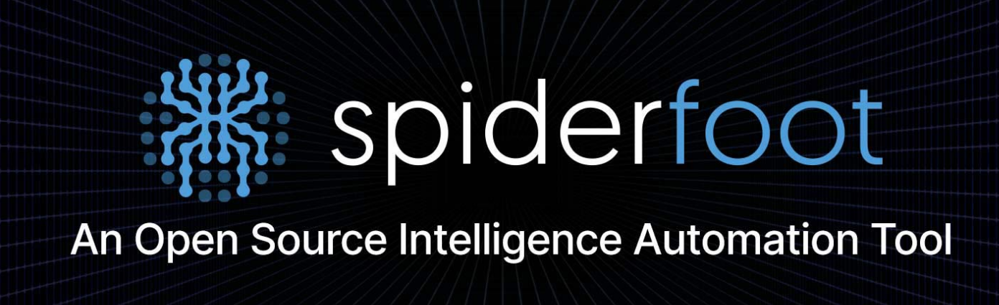
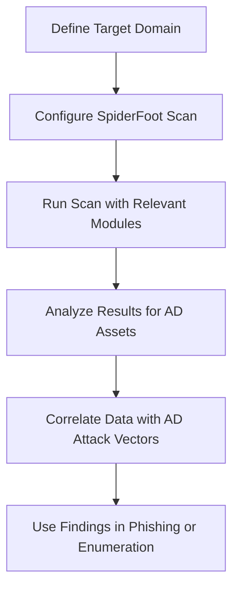

# SpiderFoot Installation and Usage for Active Directory Penetration Tests

SpiderFoot is an open-source intelligence (OSINT) automation tool used for reconnaissance and information gathering. It is particularly useful in penetration testing scenarios, including Active Directory (AD) environments, to identify potential attack vectors, exposed credentials, and misconfigurations.

## Overview of SpiderFoot

SpiderFoot automates the process of gathering intelligence about a target by querying over 100 public data sources. It can be used to map out an organization's attack surface, which is critical during AD penetration tests to identify weak points like exposed user information, subdomains, or leaked credentials.

| **Feature**               | **Description**                                                                 |
|---------------------------|---------------------------------------------------------------------------------|
| **OSINT Automation**      | Gathers data from public sources like WHOIS, DNS, Shodan, and social media.    |
| **Modular Design**        | Supports various modules for specific data collection tasks.                   |
| **Targeted Recon**        | Can focus on domains, IPs, email addresses, or usernames relevant to AD.       |
| **Integration**           | Outputs data in formats suitable for further analysis or reporting.            |

## Installation Guide

### Prerequisites
- **Operating System**: Linux (preferred) or Windows.
- **Dependencies**: Python 3.x and required libraries.
- **Optional**: Docker for containerized deployment.

### Step-by-Step Installation
1. **Clone the Repository**:
   ```bash
   git clone https://github.com/smicallef/spiderfoot.git
   cd spiderfoot
   ```

2. **Install Dependencies**:
   ```bash
   pip3 install -r requirements.txt
   ```

3. **Run SpiderFoot**:
   - For a web interface (default port 5001):
     ```bash
     python3 ./sf.py -l 127.0.0.1:5001
     ```
   - Access the interface at `http://127.0.0.1:5001`.

4. **Docker Installation (Alternative)**:
   ```bash
   docker pull spiderfoot
   docker run -p 5001:5001 spiderfoot
   ```

## Usage in Active Directory Penetration Testing

SpiderFoot can be leveraged to gather intelligence about an organization's AD environment indirectly by focusing on related assets like domains, email addresses, and employee information.

### Common Use Cases
- **Domain Enumeration**: Identify subdomains and related domains that might be tied to AD infrastructure.
- **Email Harvesting**: Collect email addresses for potential phishing or password spraying attacks.
- **Credential Leak Detection**: Check for leaked credentials on paste sites or dark web sources.
- **Employee Profiling**: Gather information about employees from social media for social engineering attacks.

### Example Workflow
Below is a simplified workflow for using SpiderFoot in an AD penetration test:



### Configuring a Scan
1. Access the SpiderFoot web interface.
2. Create a new scan and specify the target (e.g., a domain like `example.com`).
3. Select relevant modules, such as:
   - `sfp_dnsresolve` for DNS enumeration.
   - `sfp_email` for email harvesting.
   - `sfp_leakix` for checking leaked data.
4. Run the scan and review the results for actionable intelligence.

### Example Command-Line Usage
If you prefer the command line over the web interface:
```bash
python3 ./sf.py -t example.com -m sfp_dnsresolve,sfp_email -s
```
- `-t`: Specifies the target.
- `-m`: Specifies the modules to use.
- `-s`: Runs the scan silently (no web server).

## Best Practices for AD Penetration Testing with SpiderFoot
- **Scope Definition**: Ensure the target is within the agreed-upon scope of the penetration test to avoid legal or ethical issues.
- **Data Correlation**: Combine SpiderFoot findings with tools like BloodHound to map AD relationships.
- **Stealth**: Use rate-limiting options in SpiderFoot to avoid detection during scans.
- **Documentation**: Export scan results (CSV/JSON) for detailed reporting.

## Limitations
- SpiderFoot relies on public data, so it may miss internal AD-specific information.
- Results depend on the quality and coverage of the data sources queried.
- Some modules may require API keys for full functionality (e.g., Shodan, VirusTotal).

## Resources
- Official Repository: [https://github.com/smicallef/spiderfoot](https://github.com/smicallef/spiderfoot)
- Documentation: [https://www.spiderfoot.net/documentation/](https://www.spiderfoot.net/documentation/)

SpiderFoot is a powerful tool for reconnaissance in AD penetration tests when used responsibly and in conjunction with other specialized tools.


- Next
    - [OSINT Tools](../content/osint.tools.md)
   - [Table of Contents](../README.md)
   