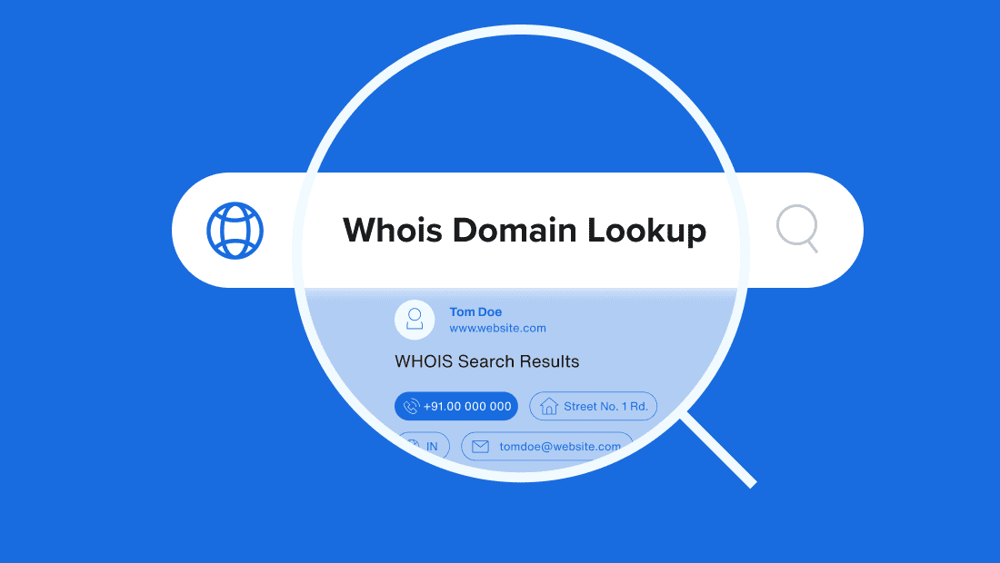
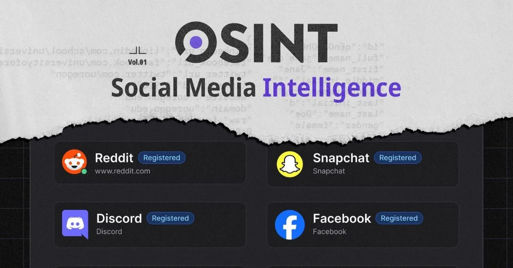
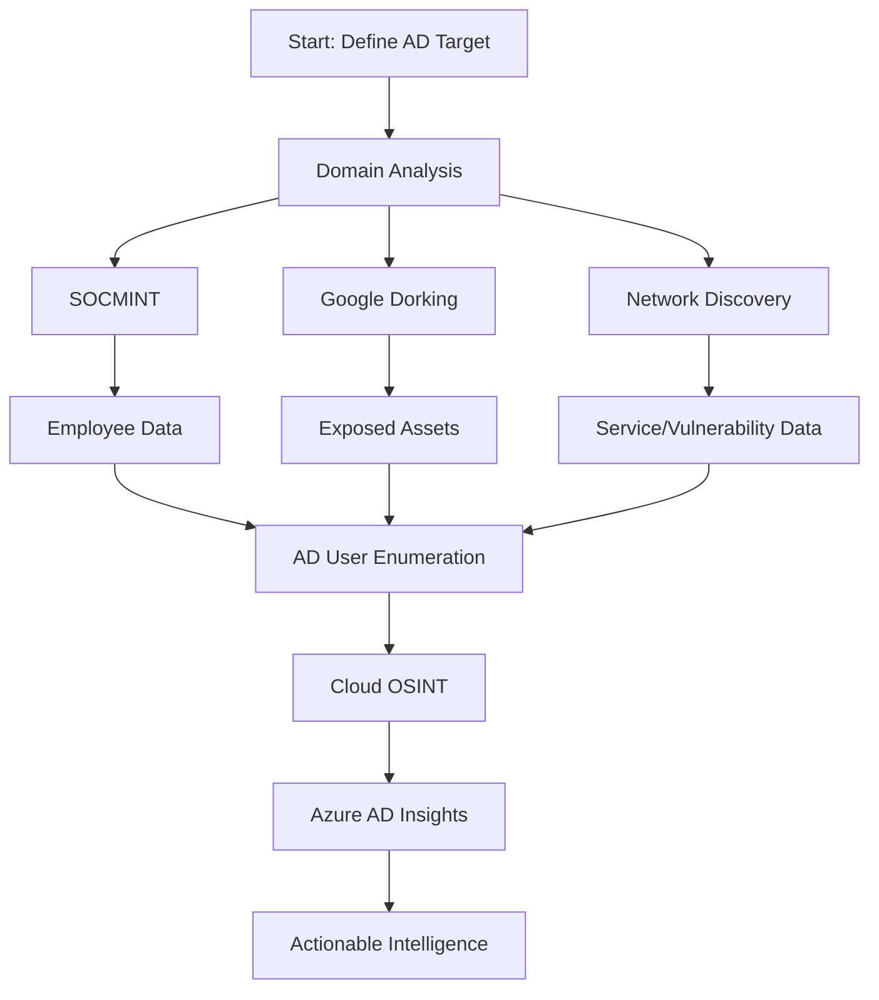

# OSINT Techniques for Active Directory Footprinting

## Overview
OSINT techniques for Active Directory (AD) footprinting focus on gathering public data to infer AD structure, users, and vulnerabilities. These methods are critical for both attackers planning reconnaissance and defenders securing their environment.

- **Goal**: Identify AD-related information (domains, users, services) using public sources.
- **Approach**: Combine passive and active techniques, with emphasis on stealth.
- **2025 Trend**: AI-enhanced tools improve efficiency in analyzing vast datasets.

## Key OSINT Techniques

### 1. Domain and Public Record Analysis
Extract organizational details to map AD infrastructure.

- **WHOIS and DNS Records**
  - Reveals registrant details, domains, and subdomains.
  - Tools: DNSDumpster, WHOIS databases.
  - Example: `vpn.company.com` may indicate AD-integrated services Chichester.
- **Business and Legal Filings**
  - Sources: SEC filings, business permits, registries.
  - Use: Identify key personnel and office locations for social engineering.

---

### 2. Social Media and Professional Networking (SOCMINT)
Uncover employee data to infer AD user accounts and structure.

- **Employee Profiling**
  - Sources: LinkedIn, Twitter, company websites.
  - Data: Names, emails, job roles (e.g., IT admins).
- **Organizational Mapping**
  - Infers AD Organizational Units (OUs) and group structures.
  - Example: LinkedIn query `site:linkedin.com "Company Name" "IT Manager"`.

---

### 3. Advanced Search Engine Reconnaissance (Google Dorking)
Discover exposed data via targeted search queries.

- **Techniques**
  - Queries: `site:company.com filetype:pdf "passwords"`, `inurl:admin login company.com`.
  - Finds: Exposed documents, login portals, AD-related configurations.
- **Impact**: Highlights misconfigurations (e.g., public AD topology diagrams).

---
 [Google Dorks Cheat Sheet](../assets/GoogleCheatSheet.pdf) 

Active Directory penetration test sample usages:

1. **site:company.com filetype:txt "username" "password"** - Searches for text files on the target domain that may contain exposed credentials.
2. **site:company.com filetype:pdf "active directory"** - Finds PDF documents mentioning Active Directory, potentially revealing structure or policies.
3. **site:company.com filetype:docx "password policy"** - Looks for Word documents detailing password policies for AD accounts.
4. **site:company.com inurl:admin** - Identifies potential admin login pages or portals on the target domain.
5. **site:company.com inurl:login "active directory"** - Searches for AD-specific login pages that might be exposed.
6. **site:company.com filetype:csv "user list"** - Finds CSV files that might contain lists of AD users or accounts.
7. **site:company.com filetype:xlsx "employee directory"** - Targets Excel files that could include AD user data or directories.
8. **site:company.com intitle:"index of" "backup"** - Looks for exposed directory listings with backup files that might include AD data.
9. **site:company.com filetype:sql "database"** - Searches for SQL dump files that could contain AD-related database information.
10. **site:company.com inurl:config "ldap"** - Identifies configuration pages or files referencing LDAP, often tied to AD.
11. **site:company.com filetype:txt "ldap" "bind"** - Finds text files mentioning LDAP bind credentials or configurations.
12. **site:company.com filetype:conf "active directory"** - Targets configuration files that might reveal AD settings or credentials.
13. **site:company.com inurl:portal "sso"** - Searches for Single Sign-On (SSO) portals, often integrated with AD.
14. **site:company.com filetype:log "error" "login"** - Looks for log files that might expose login errors or AD authentication issues.
15. **site:company.com intitle:"remote desktop" site:company.com** - Finds exposed Remote Desktop portals, often tied to AD authentication.
16. **site:company.com filetype:xml "saml"** - Searches for XML files related to SAML configurations, often used with AD for SSO.
17. **site:company.com inurl:owa** - Identifies Outlook Web Access (OWA) portals, commonly linked to AD for email access.
18. **site:company.com inurl:vpn "login"** - Finds VPN login pages that might use AD credentials for authentication.
19. **site:company.com filetype:txt "group policy"** - Looks for text files mentioning Group Policy, which governs AD settings.
20. **site:company.com filetype:pdf "network diagram"** - Searches for network diagrams in PDFs that might include AD infrastructure details.
21. **site:company.com inurl:dashboard "admin"** - Targets admin dashboards that could be tied to AD management.
22. **site:company.com filetype:doc "it admin"** - Finds documents mentioning IT admin roles, potentially revealing AD admins.
23. **site:company.com intitle:"login" "domain"** - Searches for login pages that mention domain authentication, likely AD-related.
24. **site:company.com filetype:txt "service account"** - Looks for text files listing service accounts, often used in AD environments.
25. **site:company.com inurl:sharepoint "login"** - Identifies SharePoint login pages, frequently integrated with AD.
26. **site:company.com filetype:pdf "security policy"** - Searches for security policy documents that might detail AD configurations.
27. **site:company.com inurl:management "user"** - Finds user management portals or pages linked to AD administration.
28. **site:company.com filetype:log "kerberos"** - Looks for log files mentioning Kerberos, the default authentication protocol for AD.
29. **site:company.com intitle:"error" "access denied"** - Searches for error pages that might reveal AD permission or access issues.
30. **site:company.com filetype:html "password reset"** - Targets HTML pages related to password reset functionalities, often tied to AD.

---

### 4. Network and Infrastructure Discovery
Identify AD-integrated services and vulnerabilities.

- **Shodan/Censys**
  - Detects exposed services (e.g., RDP:3389, SMB:445, LDAP:389).
  - Example: `port:3389 org:"Company Name"`.
- **Public Code Repositories**
  - Tools: grep.app, SourceGraph.
  - Finds: Leaked credentials, AD configurations on GitHub.

### Shodan and Censys Search Prompts for Active Directory Penetration Tests

Below are 30 tailored Shodan and Censys search prompts to gather information relevant to Active Directory (AD) penetration testing. These queries focus on identifying exposed services, misconfigurations, and potential entry points tied to AD environments.

#### Shodan Search Prompts
1. **`port:389 org:"Company Name"`** - Identifies exposed LDAP services, often used for AD authentication.
2. **`port:636 org:"Company Name"`** - Finds LDAPS (secure LDAP) services, indicating AD directory access points.
3. **`port:445 org:"Company Name"`** - Detects SMB services, commonly used for file sharing and AD authentication.
4. **`port:3389 org:"Company Name"`** - Locates Remote Desktop Protocol (RDP) services, often tied to AD logins.
5. **`port:88 org:"Company Name"`** - Searches for Kerberos services, the primary authentication protocol for AD.
6. **`port:3268 org:"Company Name"`** - Identifies Global Catalog LDAP services, critical for AD forest queries.
7. **`port:3269 org:"Company Name"`** - Finds secure Global Catalog LDAPS services for AD forest access.
8. **`port:135 org:"Company Name"`** - Detects RPC services, often used for AD replication and management.
9. **`port:139 org:"Company Name"`** - Searches for NetBIOS over TCP, used in older AD environments for authentication.
10. **`port:464 org:"Company Name"`** - Identifies Kerberos password change services, tied to AD user management.
11. **`hostname:"vpn.company.com"`** - Finds VPN endpoints that may use AD credentials for authentication.
12. **`hostname:"owa.company.com"`** - Detects Outlook Web Access (OWA) servers, often integrated with AD.
13. **`hostname:"mail.company.com" port:443`** - Searches for mail servers using HTTPS, likely tied to AD for authentication.
14. **`org:"Company Name" "remote desktop"`** - Identifies RDP gateways or services mentioning remote desktop access.
15. **`org:"Company Name" "active directory"`** - Finds devices or services explicitly mentioning Active Directory in banners.

#### Censys Search Prompts
16. **`services.port:389 and tags.raw:"ldap"`** - Targets LDAP services, key to AD directory access.
17. **`services.port:445 and tags.raw:"smb"`** - Identifies SMB services for potential AD file share access.
18. **`services.port:3389 and tags.raw:"rdp"`** - Detects RDP services, often secured by AD credentials.
19. **`services.port:88 and tags.raw:"kerberos"`** - Finds Kerberos authentication services used by AD.
20. **`services.port:636 and tags.raw:"ldaps"`** - Searches for secure LDAP services tied to AD environments.
21. **`services.banner:/active directory/i and autonomous_system.organization:"Company Name"`** - Identifies services mentioning AD in their banners.
22. **`services.port:135 and tags.raw:"rpc"`** - Detects RPC endpoints, often used for AD administrative tasks.
23. **`services.port:3268 and tags.raw:"ldap"`** - Finds Global Catalog LDAP services for AD forest data.
24. **`services.software.product:"Microsoft Exchange" and autonomous_system.organization:"Company Name"`** - Targets Exchange servers, typically integrated with AD.
25. **`services.banner:/owa/i and autonomous_system.organization:"Company Name"`** - Identifies Outlook Web Access portals linked to AD.
26. **`services.port:443 and services.tls.certificates.leaf_data.subject.organization:"Company Name"`** - Searches for HTTPS services with certificates tied to the target organization, often AD-related.
27. **`services.port:139 and tags.raw:"netbios"`** - Detects NetBIOS services, used in legacy AD setups.
28. **`services.banner:/vpn/i and autonomous_system.organization:"Company Name"`** - Finds VPN services that may authenticate via AD.
29. **`services.software.product:"Microsoft Windows Server" and autonomous_system.organization:"Company Name"`** - Targets Windows Server instances, likely hosting AD roles.
30. **`services.banner:/domain controller/i and autonomous_system.organization:"Company Name"`** - Searches for explicit mentions of domain controllers in service banners, indicating AD infrastructure.

### 5. Data Breach and Leaked Credential Monitoring
Uncover compromised AD credentials.

- **Tools**: HaveIBeenPwned, dark web monitoring.
- **Use**: Correlate breached emails with employee names for credential stuffing.
- **Risk**: Old breach data remains valuable for AD attacks.

### 6. Cloud-Specific OSINT (Azure AD)
Leverage Azure AD APIs for tenant and user data.

- **AADInternals**
  - Extracts tenant IDs, sync status, Global Admin details.
  - Example: Reveals sync account names for phishing.
- **Unauthenticated APIs**
  - Provide licensing, DesktopSSO, and admin contact info.

## Technique Workflow

## Strategic Insights
- **Passive Priority**: Start with passive techniques (e.g., WHOIS, SOCMINT) to avoid detection.
- **Correlation is Key**: Combine data points for a comprehensive AD footprint.
- **Cloud Focus**: Azure AD’s public APIs offer direct OSINT opportunities.

| Technique                | Data Gained                     | AD Relevance                     | Tools/Sources                |
|-------------------------|---------------------------------|---------------------------------|------------------------------|
| **Domain Analysis**     | Domains, subdomains, contacts   | Maps AD infrastructure          | WHOIS, DNSDumpster           |
| **SOCMINT**             | Employee names, roles, emails   | Infers AD users and groups     | LinkedIn, Twitter            |
| **Google Dorking**      | Exposed files, login portals    | Reveals AD misconfigurations    | Google, advanced operators   |
| **Network Discovery**   | Services, ports, vulnerabilities| Identifies AD entry points     | Shodan, Censys, SpiderFoot   |
| **Breach Monitoring**   | Leaked credentials             | Enables credential stuffing    | HaveIBeenPwned, dark web    |
| **Cloud OSINT**         | Tenant IDs, sync status, admins | Targets Azure AD vulnerabilities| AADInternals, Azure APIs     |

- Next
   - [OSINT with Nmap](../content/osint.nmap.md)
   - [Table of Contents](../README.md)