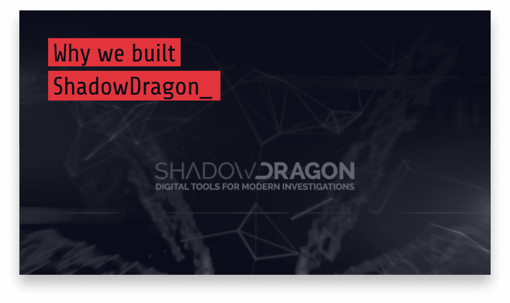
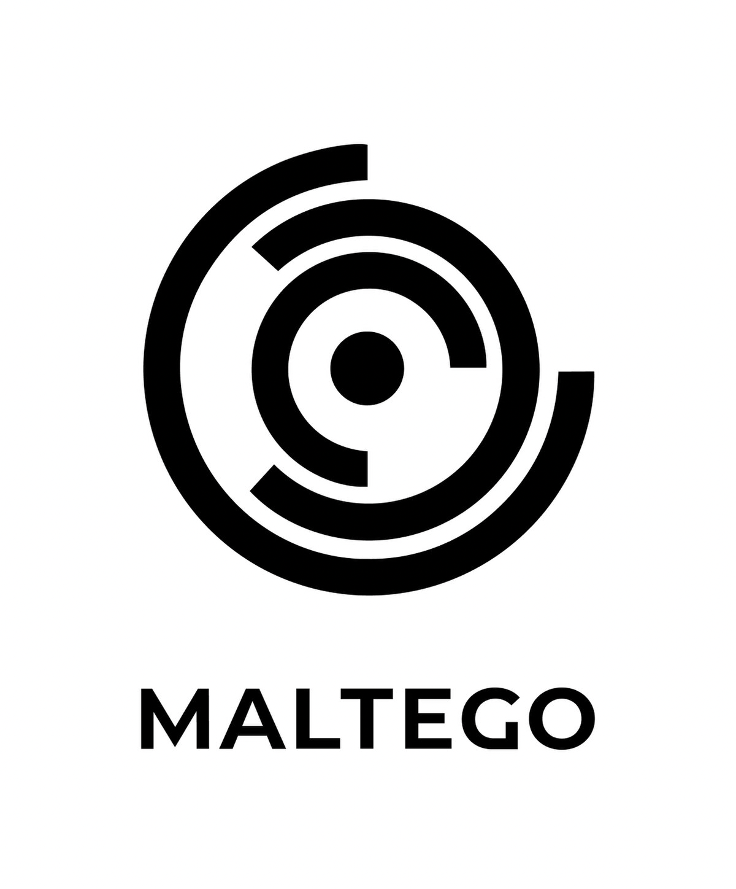
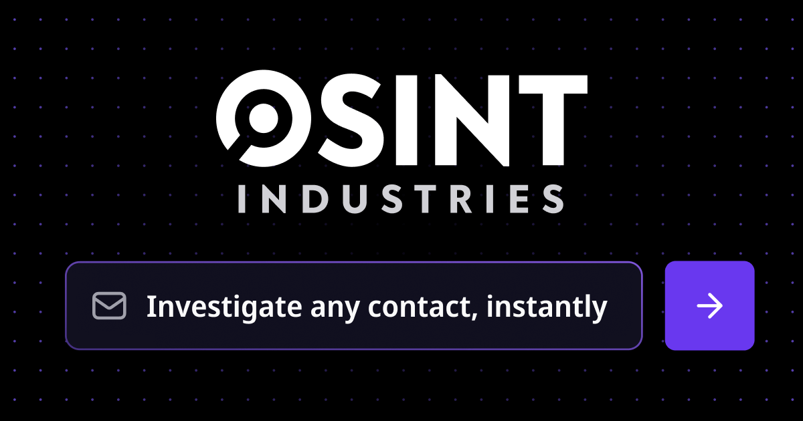
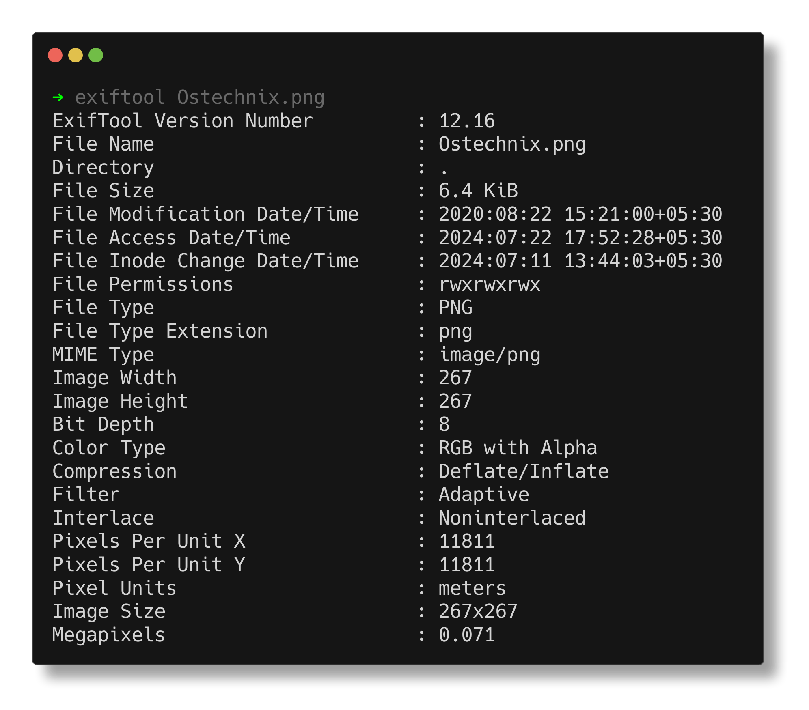
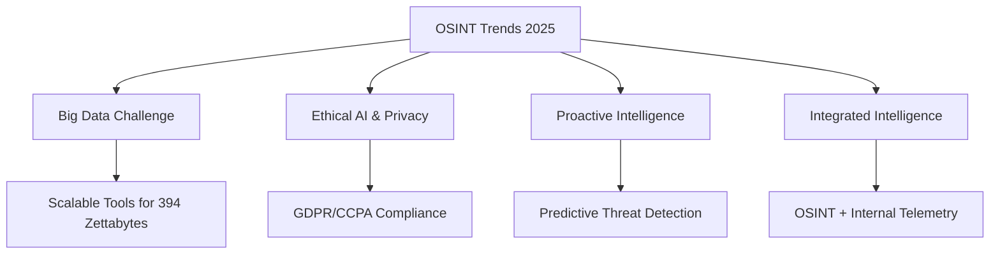

# Best Tools and Emerging Trends for AD OSINT in 2025

## Overview
In 2025, OSINT tools for Active Directory (AD) reconnaissance combine comprehensive platforms, specialized utilities, and AI-driven analytics to uncover critical insights. Emerging trends emphasize automation, scalability, and ethical considerations to handle the growing complexity of digital data.

- **Objective**: Leverage advanced tools to map AD environments effectively.
- **Focus**: Integrate traditional and cloud-specific (Azure AD) reconnaissance.
- **2025 Trend**: AI/ML transforms OSINT into proactive, predictive intelligence.

## Comprehensive OSINT Platforms
These platforms integrate multiple data sources for holistic AD reconnaissance.

&nbsp;
&nbsp;
&nbsp;

- **ShadowDragon**
  - **Function**: Gathers and visualizes data from 600+ sources.
  - **AD Use**: Monitors AD-related keywords, employee activity, and malware links.
  - **Key Features**: Horizon™ Monitor for real-time tracking, MalNet™ for malware analysis.
 

&nbsp;
&nbsp;
&nbsp;

- **Maltego**
  - **Function**: Maps relationships between entities (people, domains, emails).
  - **AD Use**: Correlates employee profiles with AD structure and attack surfaces.
  - **Key Features**: Interactive graphs, anonymous mode for stealth.
 

 &nbsp;
 &nbsp;
 &nbsp;

 
---

- **OSINT Industries**
  - **Function**: Real-time lookup of accounts tied to emails or usernames.
  - **AD Use**: Identifies breached AD credentials and employee digital footprints.
  - **Key Features**: Breach detection, interactive timelines.

## Specialized Tools for Targeted Reconnaissance
Specialized tools focus on specific AD-related data collection.

| Tool              | Primary Function                          | AD Relevance                            | Key Features (2025)                |
|-------------------|-------------------------------------------|----------------------------------------|------------------------------------|
| **AADInternals**  | Queries Azure AD via unauthenticated APIs | Extracts tenant IDs, sync status, admins | Cloud-specific, API-driven         |
| **DNSDumpster**   | Maps domain infrastructure and subdomains | Identifies AD-integrated services       | Visualizes DNS relationships      案 |
| **Shodan/Censys** | Detects exposed devices, ports, services  | Finds AD-linked services (RDP, SMB)     | IoT and vulnerability scanning     |
| **ExifTool**      | Extracts metadata from files/images       | Reveals AD naming conventions           | Metadata analysis for authenticity |
| **SpiderFoot**    | Automates OSINT data collection           | Gathers network, contact, and user data | Multi-API integration              |

### Additional Tools
- **VirusTotal**: Analyzes files/URLs for malware; checks AD-related phishing links.
- **Google Earth Pro**: Maps physical AD infrastructure (e.g., data centers).
- **Google Dorking**: Uncovers exposed AD configurations via advanced queries.
- **IntelTechniques**: Advanced searches for employee and AD-related data.

## AI and Machine Learning in OSINT
AI/ML enhances OSINT by automating data analysis and uncovering hidden patterns.

- **Role**: Processes vast datasets, filters noise, and predicts trends.
- **Platforms**:
  - **Fivecast**: Risk detection, augmented intelligence.
  - **Talkwalker/Hootsuite**: Social media monitoring, sentiment analysis.
- **AD Impact**: Detects subtle AD vulnerabilities (e.g., leaked credentials, DNS anomalies).
- **Benefit**: Acts as an "analyst force multiplier" for faster insights.

## Emerging Trends for 2025

### Key Trends
1. **Big Data Challenge**: Scalable tools to handle 394 zettabytes of data by 2028.
2. **Ethical AI & Data Privacy**: Compliance with GDPR/CCPA, bias-free AI outputs.
3. **Proactive Intelligence**: Continuous monitoring to anticipate AD threats.
4. **Integrated Intelligence**: Combines OSINT with internal data for comprehensive threat visibility.

## Strategic Insights
- **Tool Stack Approach**: Combine multiple tools for a complete AD picture.
- **AI Advantage**: Enables predictive analysis for early threat detection.
- **Ethical Focus**: Balances data collection with legal and privacy compliance.

- Next
    - [OSINT Defense Strategies](../content/osint.defense.md)
    - [Table of Contents](../README.md)
   