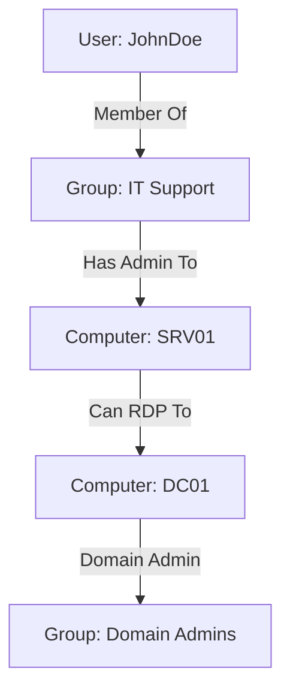

# Comprehensive Penetration Testing for Active Directory Using BloodHound

This guide provides a detailed, step-by-step approach to performing penetration tests on Active Directory (AD) environments using **BloodHound**, a powerful tool for visualizing and analyzing AD relationships to identify attack paths. From installation to advanced usage, this tutorial covers everything you need to know.

---

## Table of Contents
- [What is BloodHound?](#what-is-bloodhound)
- [Installation](#installation)
- [Basic Usage](#basic-usage)
- [Advanced Usage](#advanced-usage)
- [Visualizing Attack Paths with Mermaid](#visualizing-attack-paths-with-mermaid)
- [Additional Resources](#additional-resources)

---

## What is BloodHound?

BloodHound is an open-source tool that uses graph theory to reveal hidden and often unintended relationships within an Active Directory environment. It helps penetration testers and red teamers identify potential attack paths, such as privilege escalation opportunities, by mapping out user, group, and computer relationships.

🔗 **Learn More**: [BloodHound Official GitHub](https://github.com/BloodHoundAD/BloodHound)

---

## Installation

### Prerequisites
- **Neo4j**: A graph database to store and query the AD data.
- **BloodHound GUI**: The interface for visualizing the data.
- **SharpHound**: The data collector (ingestor) for gathering AD information.

### Step-by-Step Installation

| Step | Command/Instruction | Description |
|------|---------------------|-------------|
| 1    | Install Neo4j       | Download and install Neo4j Desktop or Community Server from [Neo4j Website](https://neo4j.com/download/). |
| 2    | Configure Neo4j     | Set up a database with a username (e.g., `neo4j`) and password (e.g., `BloodHound`). |
| 3    | Install BloodHound  | Download the latest release of BloodHound from [GitHub Releases](https://github.com/BloodHoundAD/BloodHound/releases). |
| 4    | Run BloodHound      | Launch BloodHound and log in with your Neo4j credentials. |
| 5    | Download SharpHound | Obtain SharpHound (the data collector) from the same GitHub repository. |

### Example: Running Neo4j on Linux
```bash
sudo apt update
sudo apt install neo4j
sudo systemctl enable neo4j
sudo systemctl start neo4j
```

---

## Basic Usage

### Collecting Data with SharpHound
SharpHound is used to collect data from the target Active Directory environment. Run it on a domain-joined machine or with domain credentials.

#### Command Example
```powershell
Invoke-BloodHound -c All -d domain.local -u username -p password -o output.json
```
- `-c All`: Collects all data (users, groups, computers, etc.).
- `-d`: Specifies the target domain.
- `-u` and `-p`: Credentials for authentication.
- `-o`: Output file for the collected data.

### Uploading Data to BloodHound
1. Open the BloodHound GUI.
2. Drag and drop the `output.json` file generated by SharpHound into the interface.
3. Wait for the data to process and the graph to populate.

### Exploring the Graph
- Use the search bar to find specific users, groups, or computers.
- Right-click nodes to see relationships (e.g., "Has Admin To" or "Member Of").
- Identify high-value targets like Domain Admins.

---

## Advanced Usage

### Custom Queries
BloodHound allows you to write custom Cypher queries to analyze the graph database in Neo4j. For example, to find all paths to Domain Admins:

```cypher
MATCH p=shortestPath((u:User)-[*1..]->(g:Group {name: "DOMAIN ADMINS@DOMAIN.LOCAL"})) RETURN p
```

### BloodHound Analytics
Use the built-in analytics to identify common misconfigurations:
- **Kerberoastable Users**: Accounts with Service Principal Names (SPNs) that can be targeted for Kerberoasting.
- **Unconstrained Delegation**: Systems or users with unconstrained delegation enabled, which can be abused for privilege escalation.

### Exporting Data
Export graphs as images or JSON for reports:
1. Right-click the graph area.
2. Select "Export Graph" and choose your format.

---

## Visualizing Attack Paths with Mermaid

Below is a simplified Mermaid diagram representing a potential attack path in an AD environment as visualized by BloodHound.



This diagram shows how a low-privilege user (`JohnDoe`) can escalate privileges to `Domain Admins` through a series of relationships and misconfigurations.

---

## Additional Resources
- **Documentation**: [BloodHound Documentation](https://bloodhound.readthedocs.io/)
- **Tutorials**: [YouTube Playlist on BloodHound](https://www.youtube.com/playlist?list=PLj9K9o5MgS5G32vXbM5ALP9nM6S1wJ4M_)
- **Community**: Join the BloodHound Slack or Discord for support and discussions.

By following this guide, you should be able to install, configure, and use BloodHound effectively to identify and exploit vulnerabilities in Active Directory environments. Happy hunting! 🐾