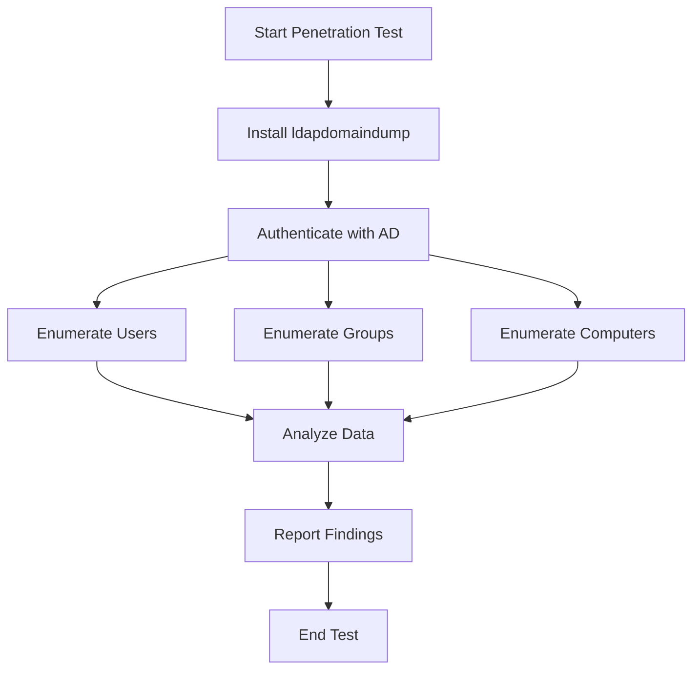

# Comprehensive Guide to Penetration Testing Active Directory Using ldapdomaindump

This guide provides a detailed walkthrough for conducting penetration tests on Active Directory (AD) environments using the tool `ldapdomaindump`. It includes installation instructions, usage examples, and visual aids to help understand the process.

## Introduction to ldapdomaindump

`ldapdomaindump` is a powerful tool used for enumerating Active Directory information via LDAP (Lightweight Directory Access Protocol). It can extract valuable data such as user accounts, groups, and computer information, which can be critical during a penetration test.

## Installation

To install `ldapdomaindump`, follow these steps:

### Prerequisites
- Python 3.x
- `pip` (Python package installer)

### Installation Steps

| Step | Command                                      | Description                          |
|------|----------------------------------------------|--------------------------------------|
| 1    | `git clone https://github.com/dirkjanm/ldapdomaindump.git` | Clone the repository                |
| 2    | `cd ldapdomaindump`                         | Navigate to the cloned directory    |
| 3    | `pip install -r requirements.txt`           | Install required Python packages    |

Alternatively, you can install it directly via pip:

```bash
pip install ldapdomaindump
```

## Usage

`ldapdomaindump` can be used to enumerate various components of an Active Directory environment. Below is a basic command to start with:

```bash
ldapdomaindump -u 'DOMAIN\username' -p 'password' -d 'domain.com' -s 'DC_IP'
```

### Command Options

| Option | Description                       | Example                     |
|--------|-----------------------------------|-----------------------------|
| `-u`   | Username for authentication       | `DOMAIN\username`          |
| `-p`   | Password for authentication       | `password`                 |
| `-d`   | Domain name                       | `domain.com`               |
| `-s`   | IP of the Domain Controller       | `192.168.1.10`             |
| `-at`  | Authentication type (NTLM/Kerberos) | `NTLM`                    |

### Output

The tool outputs data into several JSON files, including:
- `domain_users.json` - List of all domain users
- `domain_groups.json` - List of all domain groups
- `domain_computers.json` - List of all domain computers

## Workflow Diagram

Below is a Mermaid diagram illustrating the typical workflow of using `ldapdomaindump` during a penetration test:



## Additional Resources

For more detailed information and updates, refer to the official GitHub repository: [ldapdomaindump GitHub](https://github.com/dirkjanm/ldapdomaindump).

## Best Practices

- Always obtain proper authorization before conducting penetration tests.
- Use secure channels to transmit sensitive data extracted by `ldapdomaindump`.
- Regularly update the tool to leverage the latest features and security patches.

This guide aims to provide a thorough understanding of using `ldapdomaindump` for Active Directory penetration testing, from installation to data analysis.