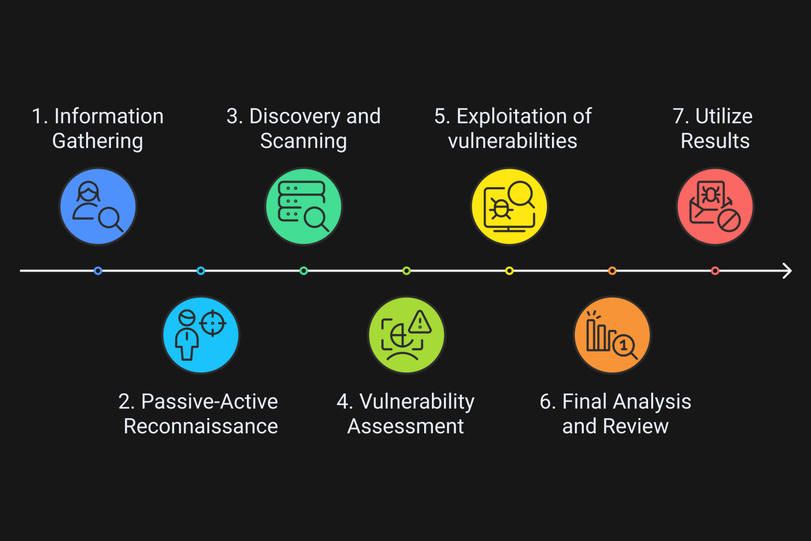

# Phases of an Active Directory Penetration Test

## Overview
A structured lifecycle ensures thorough testing and actionable outcomes.

## Phase Details

### Pre-Engagement and Planning
- **Duration**: 2-3 days
- **Activities**:
  - Define scope (systems, goals, rules).
  - Finalize NDAs and SOWs.
  - Set timeline and resources.

NDAs (Non-Disclosure Agreements) are legal contracts that protect confidential information shared during the engagement, ensuring that sensitive data is not disclosed to unauthorized parties. SOWs (Statements of Work) are detailed documents outlining the scope, objectives, deliverables, timeline, and resources for the penetration test, serving as a blueprint for the project.

### Reconnaissance and Information Gathering
- **Duration**: 4-6 days
- **Types**:
  - **Passive**: OSINT (domain data, employee info).
  - **Active**: DNS queries, LDAP recon, Nmap scans.
- **Tools**: Nmap, ldapdomaindump, BloodHound.

LDAP recon (Lightweight Directory Access Protocol reconnaissance) involves querying an Active Directory environment to gather information about users, groups, computers, and other objects. This is often done using tools like ldapdomaindump or BloodHound to extract data from the directory service, which can reveal potential misconfigurations or overly permissive access controls that may be exploited during the penetration test.

### Mapping and Vulnerability Identification
- **Duration**: 3-5 days
- **Activities**:
  - Map systems from recon data.
  - Scan for vulnerabilities (automated + manual).
  - Verify findings for accuracy.

### Exploitation
- **Duration**: 1-3 days
- **Activities**:
  - Exploit vulnerabilities to gain access.
  - Escalate privileges (e.g., to Domain Admin).
  - Use tools like Metasploit.

### Clean Up
- **Duration**: 1-2 days
- **Activities**:
  - Remove test artifacts (tools, backdoors).
  - Restore pre-test state.

### Reporting
- **Duration**: 2-4 days
- **Activities**:
  - Document vulnerabilities and impact.
  - Provide remediation steps and strategic advice.
  - Offer re-test to confirm fixes.
