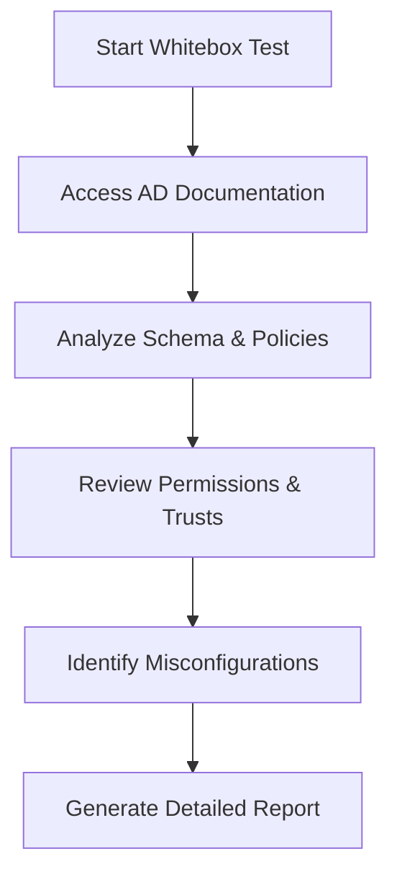
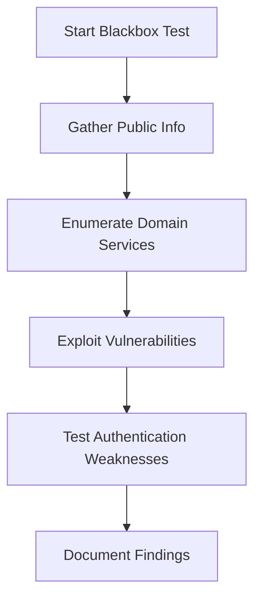
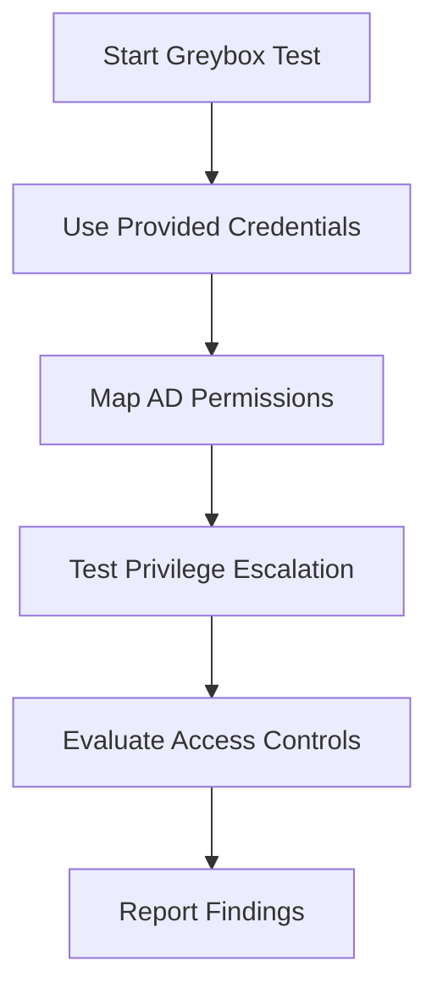

# Introduction to Active Directory Test Types

Active Directory (AD) is a critical component of many enterprise networks, managing user authentication, authorization, and access control. Penetration testing of AD environments helps identify vulnerabilities that could be exploited by attackers. This article explores the three primary testing methodologies—Whitebox, Blackbox, and Greybox—and their roles in enhancing AD security. Each approach offers unique insights into potential weaknesses, and understanding their differences is essential for robust security assessments.

## Whitebox Testing

Whitebox testing provides testers with full access and detailed knowledge of the Active Directory environment. This includes access to network diagrams, configurations, user accounts, group policies, and even source code where applicable. The approach is ideal for comprehensive internal audits, as it allows testers to examine every aspect of the AD setup, including domain controllers, trusts, and permissions.

### Key Characteristics
- **Full Transparency**: Testers have complete visibility into the AD structure, including schema, objects, and policies.
- **Use Cases**: Internal audits, compliance checks, and in-depth code reviews of custom AD integrations.
- **Advantages**: Enables thorough analysis, identifies misconfigurations, and verifies compliance with security policies.
- **Challenges**: Requires significant time and resources due to the depth of analysis.

### Example Workflow

### When to Use
Whitebox testing is best suited for organizations seeking a deep dive into their AD environment, particularly for internal teams or trusted third-party auditors aiming to uncover subtle misconfigurations or compliance gaps.

## Blackbox Testing

Blackbox testing simulates an external attacker's perspective, where testers have no prior knowledge of the AD environment. This approach mimics real-world scenarios where attackers attempt to exploit vulnerabilities without insider information. The focus is on identifying externally exploitable weaknesses, such as unsecured endpoints or weak authentication mechanisms.

### Key Characteristics
- **No Prior Knowledge**: Testers start with minimal information, often only the domain name or IP range.
- **Use Cases**: Simulating external cyberattacks, testing perimeter defenses, and evaluating public-facing AD services.
- **Advantages**: Reflects real-world attack scenarios, highlighting vulnerabilities accessible to outsiders.
- **Challenges**: Limited scope may miss internal misconfigurations; success depends heavily on tester expertise.

### Example Workflow

### When to Use
Blackbox testing is ideal for assessing how an external threat actor might target an AD environment, helping organizations strengthen their perimeter defenses and public-facing services.

## Greybox Testing

Greybox testing strikes a balance between Whitebox and Blackbox approaches, providing testers with partial knowledge of the AD environment. This method simulates insider threats or scenarios where an attacker has gained limited access, such as through a compromised user account. Greybox testing is commonly used to evaluate permissions, access controls, and privilege escalation risks.

### Key Characteristics
- **Partial Knowledge**: Testers have limited access, such as a standard user account or basic network information.
- **Use Cases**: Assessing insider threats, testing privilege escalation, and evaluating access control effectiveness.
- **Advantages**: Balances realism and depth, uncovering issues related to user permissions and lateral movement.
- **Challenges**: Requires careful scoping to avoid overly broad or narrow assessments.

### Example Workflow

### When to Use
Greybox testing is effective for organizations looking to simulate insider threats or assess the impact of a partially compromised account, focusing on privilege escalation and access control weaknesses.

## Comparing the Approaches

| **Aspect**            | **Whitebox**                     | **Blackbox**                     | **Greybox**                      |
|-----------------------|----------------------------------|----------------------------------|----------------------------------|
| **Knowledge Level**   | Full access and documentation    | No prior knowledge               | Partial knowledge                |
| **Use Case**          | Internal audits, compliance      | External attack simulation       | Insider threat simulation        |
| **Depth of Analysis** | Comprehensive                    | Surface-level, external focus    | Balanced, permission-focused     |
| **Resource Intensity**| High                             | Moderate                         | Moderate                         |
| **Realism**           | Low (assumes full trust)         | High (mimics external attacks)   | Medium (mimics partial access)   |

## Choosing the Right Approach

Selecting the appropriate testing methodology depends on the organization's goals:
- **Whitebox**: Use when a thorough, internal review is needed, especially for compliance or post-incident analysis.
- **Blackbox**: Choose for testing external defenses and understanding vulnerabilities exposed to the public.
- **Greybox**: Opt for assessing insider risks or scenarios where partial access has been gained, such as phishing attacks.

## Conclusion

Understanding Whitebox, Blackbox, and Greybox testing methodologies is crucial for securing Active Directory environments. Each approach offers distinct advantages, from the comprehensive insights of Whitebox testing to the realistic attack simulations of Blackbox testing and the balanced perspective of Greybox testing. By leveraging these methods appropriately, organizations can identify and mitigate vulnerabilities, ensuring robust AD security.

