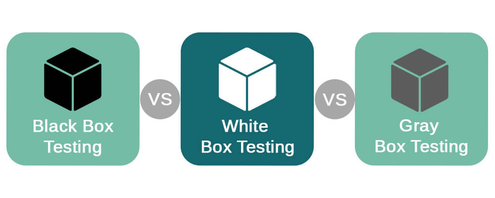
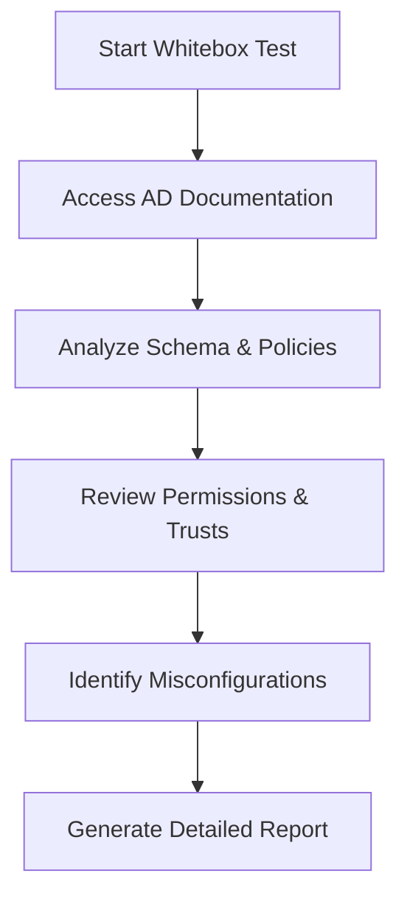
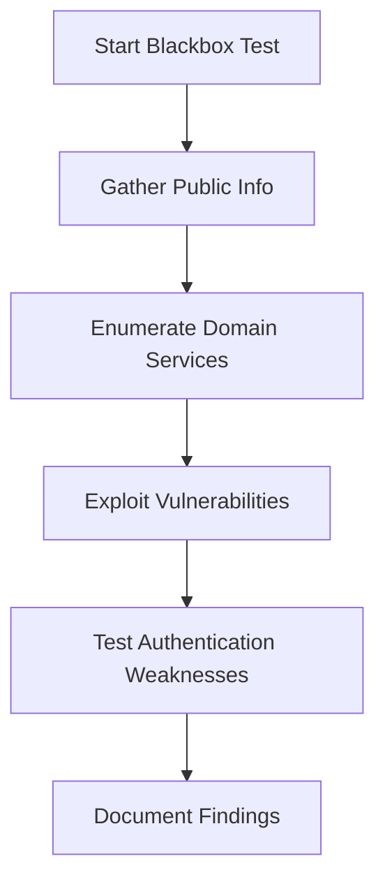
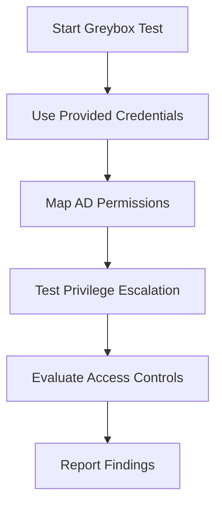
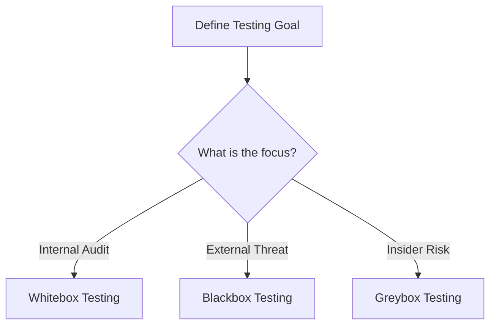
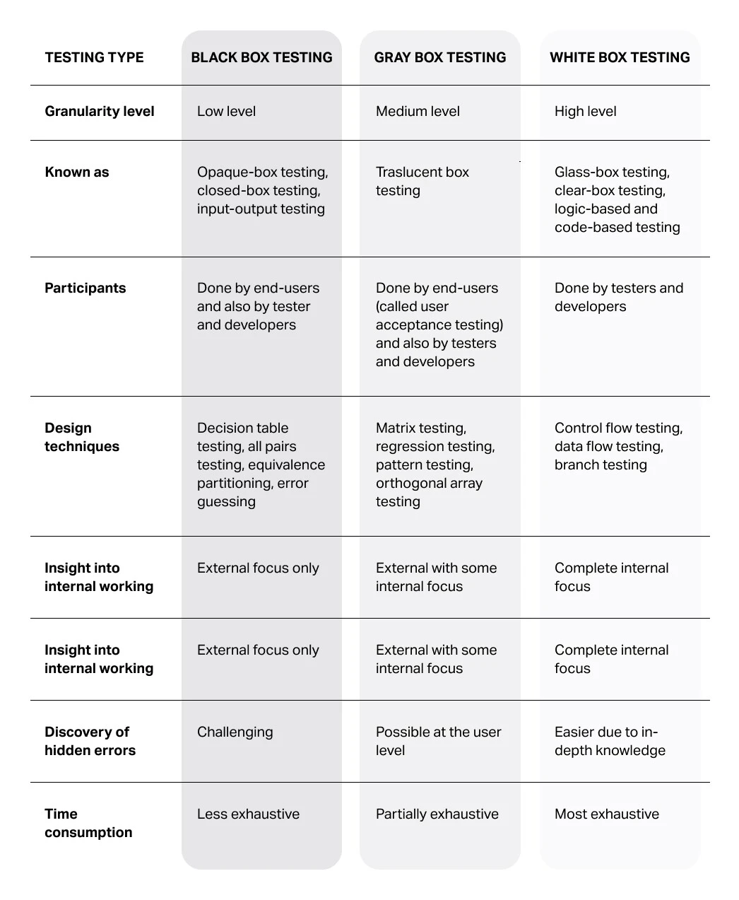

# 🌟 Introduction to Active Directory Test Types

Active Directory (AD) is the backbone of many enterprise networks, orchestrating user authentication, authorization, and access control. Penetration testing in AD environments is vital to unearth vulnerabilities that attackers could exploit. In this presentation, we’ll dive into the three core testing methodologies—**Whitebox**, **Blackbox**, and **Greybox**—and explore how they bolster AD security. Each method provides unique perspectives on potential weaknesses, making it critical to grasp their differences for effective security assessments.

---

## 🔍 Whitebox Testing: Full Visibility

Whitebox testing grants testers **complete access** and **detailed knowledge** of the Active Directory environment. Think of it as an open-book exam—testers have network diagrams, configurations, user accounts, group policies, and even source code at their fingertips. This approach is perfect for exhaustive internal audits, allowing a deep dive into every nook and cranny of the AD setup, from domain controllers to trusts and permissions.

### ✨ Key Characteristics
- **Full Transparency**: Testers see the entire AD structure, including schema, objects, and policies.
- **Use Cases**: Internal audits, compliance checks, and in-depth reviews of custom AD integrations.
- **Advantages**: Enables meticulous analysis, uncovers misconfigurations, and ensures compliance with security policies.
- **Challenges**: Demands significant time and resources due to its comprehensive nature.

### 🛠️ Example Workflow

### 📌 When to Use
Whitebox testing shines when organizations need a thorough examination of their AD environment. It’s ideal for internal teams or trusted third-party auditors aiming to detect subtle misconfigurations or compliance gaps.

---

## 🕵️‍♂️ Blackbox Testing: The Outsider’s View

Blackbox testing mimics the perspective of an **external attacker** with **no prior knowledge** of the AD environment. Imagine a hacker probing in the dark—testers start with minimal info, often just a domain name or IP range. This method focuses on identifying externally exploitable flaws, like unsecured endpoints or weak authentication mechanisms, simulating real-world cyberattack scenarios.

### ✨ Key Characteristics
- **No Prior Knowledge**: Testers begin with little to no information about the target.
- **Use Cases**: Simulating external cyberattacks, testing perimeter defenses, and evaluating public-facing AD services.
- **Advantages**: Mirrors real-world attack scenarios, exposing vulnerabilities accessible to outsiders.
- **Challenges**: Limited scope may overlook internal issues; success hinges on tester expertise.

### 🛠️ Example Workflow

### 📌 When to Use
Blackbox testing is your go-to for evaluating how an external threat actor might target an AD environment. It helps organizations fortify their perimeter defenses and secure public-facing services.

---

## ⚖️ Greybox Testing: The Middle Ground

Greybox testing offers a **balanced approach**, providing testers with **partial knowledge** of the AD environment. Picture a scenario where an attacker has gained limited access, perhaps via a compromised user account. This method is often used to assess insider threats, focusing on permissions, access controls, and the risk of privilege escalation.

### ✨ Key Characteristics
- **Partial Knowledge**: Testers have limited access, such as a standard user account or basic network details.
- **Use Cases**: Assessing insider threats, testing privilege escalation, and evaluating access control effectiveness.
- **Advantages**: Combines realism with depth, revealing issues tied to user permissions and lateral movement.
- **Challenges**: Requires precise scoping to avoid overly broad or narrow assessments.

### 🛠️ Example Workflow

### 📌 When to Use
Greybox testing excels when simulating insider threats or evaluating the impact of a partially compromised account. It’s particularly useful for identifying privilege escalation paths and access control weaknesses.

---

## ⚖️ Comparing the Approaches

| **Aspect**            | **Whitebox**                       | **Blackbox**                       | **Greybox**                       |
|-----------------------|------------------------------------|------------------------------------|-----------------------------------|
| **Knowledge Level**   | Full access & documentation        | No prior knowledge                 | Partial knowledge                 |
| **Use Case**          | Internal audits, compliance        | External attack simulation         | Insider threat simulation         |
| **Depth of Analysis** | Comprehensive                      | Surface-level, external focus      | Balanced, permission-focused      |
| **Resource Intensity**| High                               | Moderate                           | Moderate                          |
| **Realism**           | Low (assumes full trust)           | High (mimics external attacks)     | Medium (mimics partial access)    |

---

## 🧭 Choosing the Right Approach

Selecting the best testing methodology depends on your organization’s goals:
- **Whitebox**: Opt for this when a detailed internal review is needed, especially for compliance or post-incident analysis.
- **Blackbox**: Choose this to test external defenses and uncover vulnerabilities exposed to the public.
- **Greybox**: Go with this to assess insider risks or scenarios where partial access (e.g., via phishing) has been gained.

### Decision Flow

